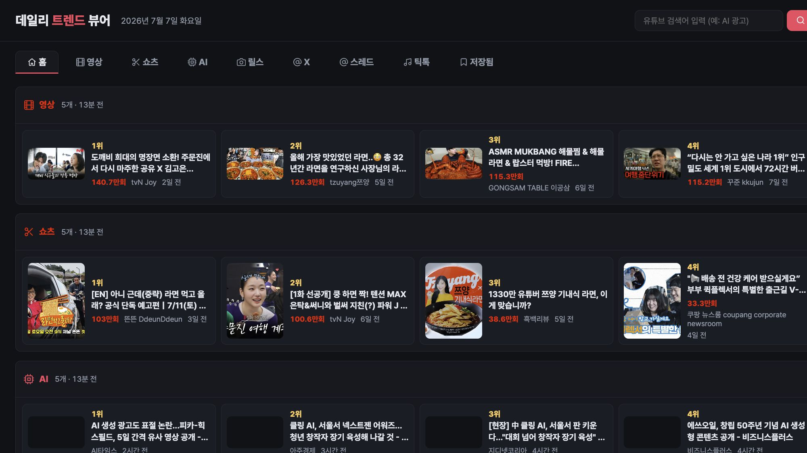
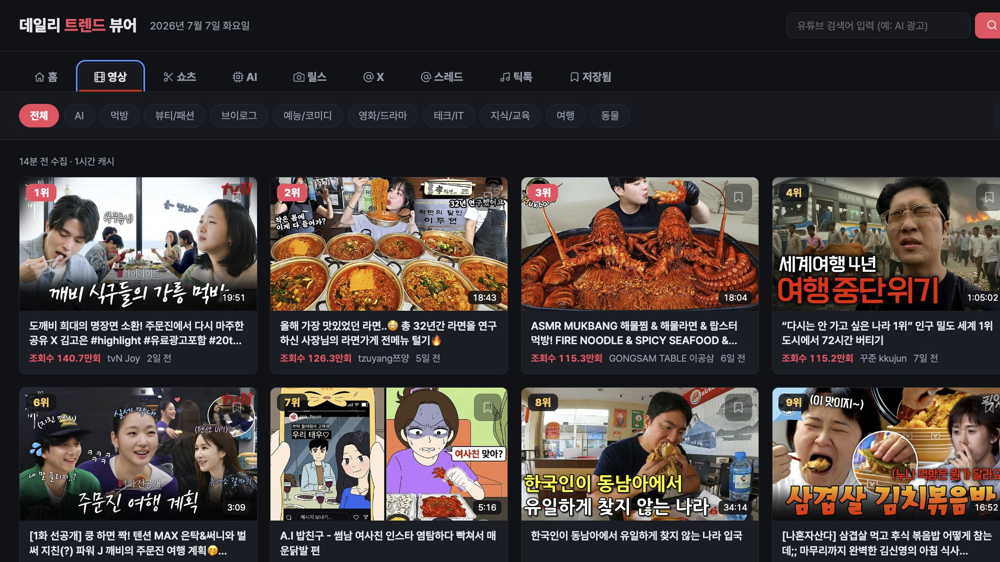
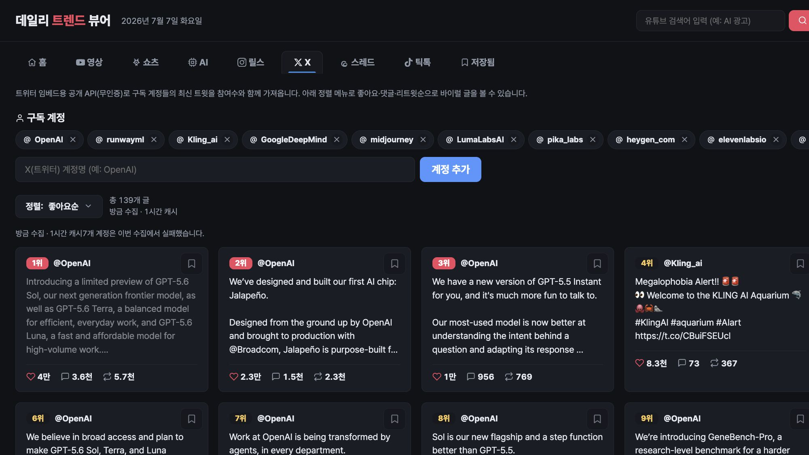
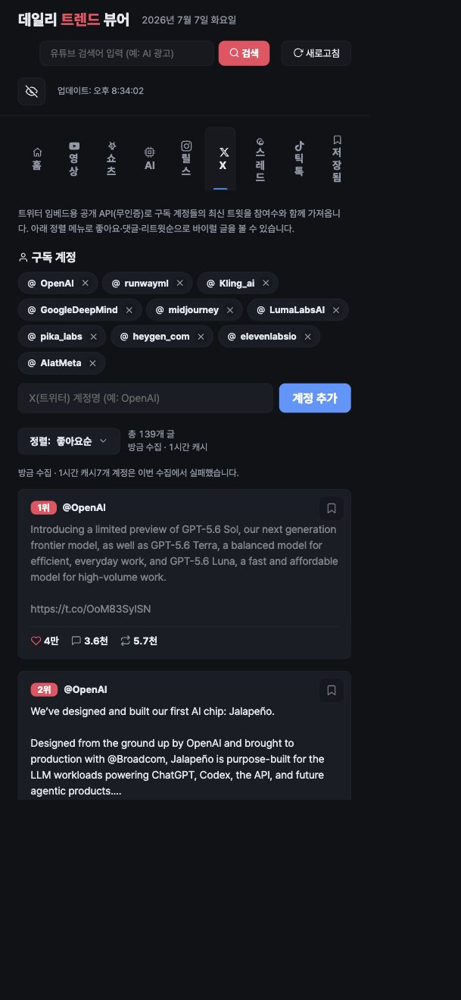

<div align="center">

# trend-viewer

### 유튜브, 릴스, X, 스레드, 틱톡, AI 뉴스를 한 화면에서 보는 로컬 트렌드 관제판

[](#실행)
[](LICENSE)
[](#테스트)

</div>

---

브라우저 탭 7개를 열지 않아도 됩니다. `python3 src/main.py` 한 줄이면
`http://localhost:8779`에서 오늘 볼 만한 흐름을 바로 훑을 수 있습니다.

추가 패키지 설치는 필요 없습니다. **Python 표준 라이브러리만 사용합니다.**

<div align="center">

| 홈 브리핑 (데스크톱) | 영상 탭 |
|:---:|:---:|
|  |  |

| X 탭 | 홈 (모바일) |
|:---:|:---:|
|  |  |

</div>

---

## 왜 만들었나요

트렌드는 플랫폼마다 다르게 보입니다. 유튜브는 조회수와 카테고리가 중요하고,
릴스와 틱톡은 계정 흐름을 같이 봐야 합니다. X와 스레드는 텍스트 맥락과
참여 지표가 핵심입니다. 이걸 매일 탭 7개로 확인하는 건 비효율입니다.

`trend-viewer`는 이 흐름을 로컬 브라우저 한 장에 모읍니다. 로그인 정보는
서버로 보내지 않습니다. 계정 목록과 캐시는 이 기기 안의 파일로 관리합니다.

---

## 실행

```bash
python3 src/main.py
# 브라우저에서 http://localhost:8779
```

포트를 바꾸려면 환경변수를 넣으세요.

```bash
TREND_VIEWER_PORT=8780 python3 src/main.py
```

---

## 탭별 상세

### 홈 (데일리 브리핑)

첫 화면입니다. 아래 모든 플랫폼의 상위 5개 항목을 한 페이지에 모아 보여줍니다.
각 섹션 헤더의 화살표를 누르면 해당 탭 전체 보기로 이동합니다.

### 영상

유튜브 인기 영상을 카테고리(전체, AI, 먹방, 뷰티/패션, 브이로그, 예능/코미디,
영화/드라마, 테크/IT, 지식/교육, 여행, 동물)별로, 기간(오늘, 이번 주, 이번 달)별로
필터링합니다. 검색어 입력도 가능합니다. 카드 클릭 시 팝업으로 바로 재생합니다.

- 데이터 소스: YouTube InnerTube 검색 API (무인증, 조회수순)
- 제한: 공식 API가 아니므로 YouTube 정책 변경 시 영향 가능

### 쇼츠

유튜브 쇼츠만 따로 봅니다. 카테고리와 기간 필터를 영상 탭과 공유합니다.

- 데이터 소스: InnerTube `shorts=1` 파라미터

### AI

AI 영상 모델(Hugging Face 트렌딩/최신)과 국내외 AI 뉴스(Google News RSS)를
한 탭에 모읍니다. 영상이 아닌 텍스트 중심 보기입니다.

- 데이터 소스: Hugging Face API + Google News RSS
- 제한: RSS 피드 지연 있음

### 릴스

인스타그램 공개 프로필의 릴스를 수집합니다. 계정을 화면에서 추가/삭제할 수 있습니다.
접이식 정렬 메뉴로 조회수순/좋아요순/댓글순을 전환합니다.

- 데이터 소스: Instagram `web_profile_info` API (공개 앱 ID 헤더, 무인증)
- 제한: **메타가 비로그인 접근을 차단할 경우 계정 바로가기로 자동 폴백합니다.**
  차단 여부는 시간대에 따라 달라집니다. 캐시(1시간)로 요청 빈도를 줄입니다.

### X (트위터)

구독 계정들의 최신 트윗을 참여 지표(좋아요, 댓글, 리트윗, 조회수)와 함께 봅니다.

- 데이터 소스: `syndication.twitter.com` 임베드 위젯 API (무인증)
- 구현: Python urllib의 TLS 핑거프린트가 Cloudflare에 차단되므로
  `subprocess`로 시스템 `curl`을 호출합니다 (`x_twitter_tool.py`).
- 제한: 조회수(impressions)는 이 API에 항상 포함되지 않습니다.
  계정별로 rate limit(429)이 걸릴 수 있으며, 실패한 계정 수를 화면에 표시합니다.

### 스레드

Threads GraphQL 엔드포인트로 로그인 없이 실시간 조회를 시도합니다.

- 데이터 소스: `threads.com/api/graphql` (LSD 토큰 + doc_id)
- 제한: **현재 메타가 비로그인 조회를 거의 차단하는 상태입니다.**
  `doc_id`가 수시로 바뀌어 안정 조회가 어렵습니다. 조회 실패 시
  각 계정 바로가기 링크로 자동 폴백합니다.

### 틱톡

실시간 인기 피드(한국)와 구독 계정 최신 영상을 함께 봅니다.

- 데이터 소스: tikwm 공개 API (`www.tikwm.com/api`)
- 제한: 무료 티어라 동시성이 높으면 일시 제한됩니다. 동시성 3으로 호출하고
  1시간 캐시합니다.

### 저장됨

카드 위에 보이는 북마크 아이콘을 누르면 이 탭에 모입니다. 저장 항목은
`config/saved_items.json`에 기록되고, 삭제도 화면에서 할 수 있습니다.

---

## 편의 기능

| 기능 | 설명 |
| --- | --- |
| 북마크 | 카드 우상단 아이콘 클릭으로 저장/해제, 저장됨 탭에서 모아보기 |
| 캐시 나이 | 각 탭 상단에 "N분 전 수집 · 1시간 캐시" 표시 |
| 오류 표시 | 수집 실패 시 이유(429 등)와 실패 계정 수를 화면에 표시 |
| 본 항목 흐리기 | 클릭한 카드는 다음 방문 시 살짝 어두워짐 (헤더 버튼으로 초기화) |
| 키보드 단축키 | `1`~`9` 탭 전환, `/` 검색 포커스, `Esc` 모달 닫기 |
| URL 해시 복원 | 탭/카테고리/기간/검색이 `#hash`에 남아 새로고침 시 복원 |
| 반응형 레이아웃 | 모바일 폭에서 탭이 한 줄 가로 스크롤로 전환 |

---

## 계정 설정

계정 기반 피드를 보려면 `config/` 안에 JSON 파일을 만듭니다.
이 파일들은 `.gitignore`에 등록되어 있어 개인 설정이 공유되지 않습니다.

```json
["xazinga", "openai"]
```

| 플랫폼 | 파일 | 기본 계정 수 |
| --- | --- | --- |
| 릴스 | `config/reels_accounts.json` | 9 |
| X | `config/x_accounts.json` | 10 |
| 스레드 | `config/threads_accounts.json` | 5 |
| 틱톡 | `config/tiktok_accounts.json` | 8 |

파일이 없으면 코드에 내장된 기본 계정 목록으로 동작합니다.

---

## API 엔드포인트

모든 엔드포인트는 `GET`이며 JSON을 반환합니다.

| 경로 | 설명 | 주요 파라미터 |
| --- | --- | --- |
| `/api/videos` | 유튜브 영상/쇼츠 | `category`, `period`, `shorts`, `q`, `force` |
| `/api/reels` | 릴스 | `force` |
| `/api/x` | X 타임라인 | `force` |
| `/api/threads` | 스레드 | `force` |
| `/api/tiktok` | 틱톡 | `force` |
| `/api/ai` | AI 모델/뉴스 | `force` |
| `/api/categories` | 유튜브 카테고리 목록 | |
| `/api/saved` | 저장된 항목 (GET/POST) | POST: `{action, source, title, url, ...}` |
| `/api/img` | 이미지 프록시 | `u` (원본 URL) |
| `/api/oembed` | oEmbed 정보 | `u` |
| `/api/{source}/accounts` | 계정 추가/삭제 (POST) | `{action, username}` |

소셜 엔드포인트(`/api/x`, `/api/reels`, `/api/threads`)의 응답에는 수집 상태가 포함됩니다.

```json
{
  "posts": [...],
  "accounts": ["OpenAI", ...],
  "fetchedAt": 1783421000,
  "cacheTtl": 3600,
  "status": "ok | empty | error | partial",
  "errors": [{"account": "...", "kind": "http", "code": 429}]
}
```

`force=1`을 붙이면 캐시를 무시하고 새로 수집합니다.

---

## 환경변수

| 변수 | 기본값 | 설명 |
| --- | --- | --- |
| `TREND_VIEWER_PORT` | `8779` | HTTP 서버 포트 |
| `TREND_VIEWER_CACHE_TTL` | `3600` | 정상 결과 캐시 TTL (초) |

---

## 프로젝트 구조

원본은 `_upstream/`의 단일 파일 프로토타입입니다. 현재 버전은 같은 기능을
기능별 모듈로 나눠 포팅한 구조입니다.

```text
trend-viewer/
├── src/
│   ├── main.py              # HTTP 서버, 라우팅, 정적 HTML 제공
│   ├── settings.py           # 포트, 경로, 캐시, 이미지 프록시 허용 도메인
│   ├── frontend/
│   │   └── index.html        # 단일 파일 프론트엔드 (HTML + CSS + JS)
│   ├── shared/
│   │   ├── cache_tool.py     # TTL 기반 인메모리 캐시
│   │   ├── http_tool.py      # HTTP GET/JSON 래퍼
│   │   ├── accounts_tool.py  # 계정 목록 로드/저장
│   │   ├── img_proxy_tool.py # CDN 이미지 프록시
│   │   ├── saved_items_tool.py # 북마크 영속화
│   │   └── test_*.py         # 공유 모듈 테스트
│   ├── youtube/              # InnerTube API 수집
│   ├── reels/                # Instagram web_profile_info 수집
│   ├── x_twitter/            # syndication API + curl subprocess 수집
│   ├── threads/              # GraphQL + LSD 토큰 수집
│   ├── tiktok/               # tikwm API 수집
│   └── ai_news/              # Hugging Face + Google News RSS
├── config/                   # 사용자 계정/저장 파일 (.gitignore)
├── _upstream/                # 원본 단일 파일 서버 (읽기 전용 참조)
├── docs/                     # 스크린샷
└── devlog/                   # 개발 로그와 계획 문서
```

Python import 규칙 때문에 폴더명은 `snake_case`를 씁니다. 각 기능 폴더에
`*_tool.py`(로직)와 `test_*.py`(테스트)를 같이 둡니다.

---

## 테스트

```bash
python3 -m unittest discover -s src -p 'test_*.py'
```

현재 66개 테스트가 등록되어 있습니다. 외부 API 호출은 전부 mock 처리되어
오프라인에서도 실행됩니다.

---

## 업데이트

```bash
git pull
```

`config/` 안의 계정 목록과 저장 항목은 `.gitignore`에 등록된 개인 파일이라
업데이트해도 그대로 유지됩니다. 받은 뒤에는 서버를 껐다가 다시 켜 주세요.

---

## 트러블슈팅

| 증상 | 원인과 해결 |
| --- | --- |
| X 탭이 "일시적으로 가져오지 못했습니다" | X syndication API의 rate limit(429)입니다. 2분 후 새로고침하면 재시도됩니다. |
| 릴스/스레드가 바로가기만 보입니다 | 메타가 비로그인 API 접근을 차단한 상태입니다. 시간이 지나면 풀리기도 합니다. |
| 틱톡 데이터가 비어 있습니다 | tikwm 무료 API 일시 제한입니다. 잠시 후 다시 시도하세요. |
| 포트가 이미 사용 중입니다 | `TREND_VIEWER_PORT=8780 python3 src/main.py`로 다른 포트를 쓰세요. |
| 썸네일이 안 보입니다 | 이미지 프록시(`/api/img`)가 허용 도메인만 통과합니다. `settings.py`의 `IMG_PROXY_ALLOW` 확인. |

---

## 기여

1. 이 저장소를 fork 합니다.
2. 기능 브랜치를 만듭니다: `git checkout -b feat/my-feature`
3. 변경 후 테스트를 돌립니다: `python3 -m unittest discover -s src -p 'test_*.py'`
4. 커밋합니다: `git commit -m "feat: describe your change"`
5. PR을 올립니다.

커밋 메시지는 `feat|fix|refactor|docs|test|chore: 설명` 형식을 따릅니다.
외부 패키지를 추가하지 마세요 (stdlib only 원칙).

---

## 함께 만든 사람

이 저장소는 [`xazingatrend`](https://github.com/xazingatrend) 조직에서
공개 관리합니다.

| 역할 | 이름 |
| --- | --- |
| 원본 아이디어/운영 맥락 | `xazinga` |
| 운영 연락 | `geonu0812@gmail.com` |
| GitHub 조직 | [`xazingatrend`](https://github.com/xazingatrend) |
| GitHub contributor | [`lidge-jun`](https://github.com/lidge-jun) |
| Git 커밋 작성자 | `bitkyc08-arch <bitkyc08@gmail.com>` |

---

## 더 읽을 문서

- 포팅 계획: [`devlog/_plan/010_porting-plan.md`](devlog/_plan/010_porting-plan.md)
- 프론트엔드 정책: [`devlog/_plan/020_frontend-policy.md`](devlog/_plan/020_frontend-policy.md)
- CI 파이프라인 계획: [`devlog/_plan/100_ci-pipeline.md`](devlog/_plan/100_ci-pipeline.md)
- 기능별 구조 문서: [`devlog/str_func/`](devlog/str_func/)
- 완료된 작업 로그: [`devlog/_fin/`](devlog/_fin/)

---

## 라이선스

MIT

---

## 변경 기록

- 2026-07-07: README 확장 (배지, 스크린샷 갤러리, API 레퍼런스,
  트러블슈팅, 기여 가이드)
- 2026-07-07: X syndication을 curl subprocess로 전환해 TLS 차단 해결
- 2026-07-07: 피드 오류 계약(status/errors) 추가, 실패 결과 120초 단기 캐시
- 2026-07-07: 반복 사용 인체공학 (dimming, hash 복원, 단축키, 모바일 탭)
- 2026-07-07: 저장 루프 완성 (북마크 토글, 저장됨 탭, 캐시 나이, 폴백 배너)
- 2026-07-07: 홈 브리핑 탭과 캐시 메타데이터 API 추가
- 2026-07-07: 단일 파일 프로토타입을 stdlib 기반 feature 구조로 포팅
