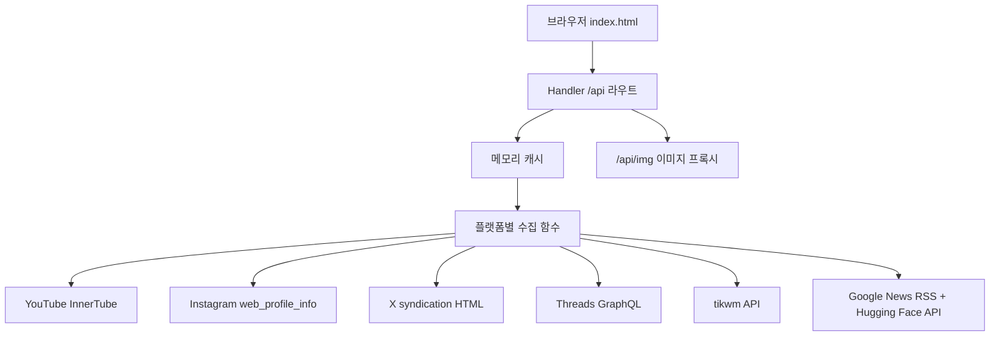

# 업스트림 트렌드 뷰어 분석

이 업스트림은 로컬에서 하루 트렌드를 훑어보기 위한 작은 웹앱이다. README는 이 앱을 유튜브 인기 동영상, 쇼츠, 인스타 릴스, X 글, 스레드, 틱톡, AI 영상 소식을 카테고리와 지표 기준으로 확인하는 로컬 웹사이트라고 설명한다. `_upstream/README.md:3`, `_upstream/README.md:16`, `_upstream/README.md:19`, `_upstream/README.md:20`, `_upstream/README.md:21`, `_upstream/README.md:22`

구조는 의도적으로 단순하다. 서버는 `server.py` 한 파일로 이루어진 표준 라이브러리 기반 HTTP 서버이고, 프론트엔드는 `index.html` 한 파일 안에 CSS, HTML, JavaScript를 모두 넣는다. 서버 파일의 헤더는 외부 패키지 없이 표준 라이브러리만 사용한다고 밝히며, 실제 import도 `urllib`, `http.server`, `ThreadingHTTPServer`, `xml.etree.ElementTree`, `ThreadPoolExecutor` 등 표준 라이브러리로만 구성된다. `_upstream/server.py:2`, `_upstream/server.py:3`, `_upstream/server.py:6`, `_upstream/server.py:18`

데이터 흐름은 브라우저가 `/api/*` 라우트를 호출하고, 서버가 각 플랫폼의 공개 또는 내부 엔드포인트를 대신 호출한 뒤 JSON으로 정규화해서 돌려주는 방식이다. 라우팅은 `Handler.do_GET`와 `Handler.do_POST`에 집중되어 있고, 각 GET 라우트는 `get_videos`, `get_reels`, `get_x_posts`, `get_threads_posts`, `get_tiktok`, `get_ai_data`, `fetch_oembed`, 이미지 프록시 로직으로 위임된다. `_upstream/server.py:669`, `_upstream/server.py:679`, `_upstream/server.py:696`, `_upstream/server.py:701`, `_upstream/server.py:706`, `_upstream/server.py:711`, `_upstream/server.py:716`, `_upstream/server.py:721`, `_upstream/server.py:725`

서버의 핵심 설계는 “무인증 수집 + 1시간 메모리 캐시 + 낮은 동시성으로 외부 제한 완화”이다. 일반 API 캐시는 `_cache`와 `cached()`가 담당하고 TTL은 3600초이며, 이미지 프록시는 별도의 `_img_cache`와 최대 600개 제한을 둔다. `_upstream/server.py:22`, `_upstream/server.py:26`, `_upstream/server.py:31`, `_upstream/server.py:144`, `_upstream/server.py:154`, `_upstream/server.py:732`, `_upstream/server.py:742`

프론트엔드는 상태 관리 라이브러리 없이 전역 객체와 전역 배열로 동작한다. `state`는 현재 탭, 카테고리, 기간, 검색어를 들고, 각 탭은 `vidData`, `reelsData`, `social`, `tiktokData`, `aiLoaded` 같은 독립 전역 상태를 사용한다. `_upstream/index.html:283`, `_upstream/index.html:317`, `_upstream/index.html:318`, `_upstream/index.html:400`, `_upstream/index.html:460`, `_upstream/index.html:552`, `_upstream/index.html:749`

포팅 관점에서 이 코드는 기능별 모듈 경계가 이미 주석으로 암시되어 있다. 서버에는 유튜브, 인스타그램 릴스, X, 스레드, 틱톡, AI 영상 탭, 기타, Handler 구간이 구분되어 있고, 프론트엔드도 유튜브/쇼츠, 재생 모달, AI 탭, 릴스, X·스레드 공통, 틱톡, 탭/기간/검색/새로고침 구간으로 나뉜다. `_upstream/server.py:33`, `_upstream/server.py:60`, `_upstream/server.py:68`, `_upstream/server.py:75`, `_upstream/server.py:82`, `_upstream/server.py:92`, `_upstream/server.py:637`, `_upstream/server.py:656`, `_upstream/index.html:316`, `_upstream/index.html:385`, `_upstream/index.html:399`, `_upstream/index.html:459`, `_upstream/index.html:545`, `_upstream/index.html:748`, `_upstream/index.html:836`

가장 취약한 부분은 외부 플랫폼의 비공식 계약에 의존하는 지점이다. 유튜브는 InnerTube `clientVersion`과 protobuf 필터 파라미터에 기대고, 인스타그램은 공개 앱 ID 헤더와 `web_profile_info`를 쓴다. X는 임베드용 syndication HTML의 `__NEXT_DATA__` 구조를 파싱하고, 스레드는 LSD 토큰, Meta 앱 ID, GraphQL `doc_id` 후보 목록에 의존한다. 틱톡은 공식 웹 API 대신 tikwm 공개 API를 쓰며, 썸네일은 핫링크 차단을 피하기 위해 서버 프록시 허용 목록을 통과해야 한다. `_upstream/server.py:113`, `_upstream/server.py:187`, `_upstream/server.py:194`, `_upstream/server.py:291`, `_upstream/server.py:294`, `_upstream/server.py:350`, `_upstream/server.py:356`, `_upstream/server.py:406`, `_upstream/server.py:427`, `_upstream/server.py:449`, `_upstream/server.py:527`, `_upstream/server.py:538`, `_upstream/server.py:101`, `_upstream/server.py:729`

포팅할 때는 “기능을 먼저 나누고, 외부 계약을 플랫폼 어댑터 안에 가두는 것”이 핵심이다. 현재 서버의 비공식 엔드포인트, 헤더, 파싱 규칙은 기능별 어댑터에 보존하고, HTTP 호출, 캐시, 계정 저장소, 이미지 프록시, 라우트 계약은 공유 계층으로 분리해야 한다. `_upstream/server.py:122`, `_upstream/server.py:134`, `_upstream/server.py:144`, `_upstream/server.py:264`, `_upstream/server.py:275`, `_upstream/server.py:725`, `_upstream/server.py:750`

---

## 1. 전체 구조 개요

### 앱 목적

- 로컬 브라우저에서 여러 플랫폼의 트렌드 콘텐츠를 한 화면에서 확인한다. `_upstream/README.md:3`
- API 키와 외부 패키지 없이 실행하는 것이 명시된 목표다. `_upstream/README.md:4`
- 실행 방식은 `python3 ~/trend-viewer/server.py` 후 `http://localhost:8778` 접속이다. `_upstream/README.md:8`, `_upstream/README.md:12`
- 기능 표면은 유튜브, 쇼츠, AI 영상, 릴스, X, 스레드, 틱톡 탭으로 구성된다. `_upstream/index.html:147`, `_upstream/index.html:155`

### 런타임 아키텍처

- 서버는 `ThreadingHTTPServer`를 `127.0.0.1:8778`에 띄운다. `_upstream/server.py:20`, `_upstream/server.py:778`, `_upstream/server.py:781`
- 정적 HTML은 `/` 또는 `/index.html` 요청에서 `BASE_DIR/index.html`을 읽어 반환한다. `_upstream/server.py:674`, `_upstream/server.py:676`
- API 응답은 `_send()`가 JSON 직렬화, `Content-Type`, `Content-Length`, `Cache-Control: no-store`를 설정해서 반환한다. `_upstream/server.py:660`, `_upstream/server.py:667`
- 프론트엔드는 서버와 같은 origin의 상대 경로 API만 호출한다. `_upstream/index.html:296`, `_upstream/index.html:338`, `_upstream/index.html:408`, `_upstream/index.html:469`, `_upstream/index.html:639`, `_upstream/index.html:758`

### 데이터 흐름



- 브라우저는 탭 전환 시 해당 탭의 로더를 호출한다. `_upstream/index.html:837`, `_upstream/index.html:855`
- 유튜브/쇼츠는 `/api/videos`에 카테고리, 기간, 쇼츠 여부, 강제 갱신, 좋아요 보강 여부, 검색어를 보낸다. `_upstream/index.html:321`, `_upstream/index.html:336`, `_upstream/server.py:679`, `_upstream/server.py:689`
- 릴스, X, 스레드, 틱톡은 각각 `/api/reels`, `/api/x`, `/api/threads`, `/api/tiktok`에서 `posts` 또는 `reels`, `accounts`, `fetchedAt`를 받는다. `_upstream/server.py:696`, `_upstream/server.py:713`
- AI 탭은 `/api/ai`에서 뉴스와 Hugging Face 모델 목록을 받는다. `_upstream/server.py:716`, `_upstream/server.py:718`
- 인스타그램, X, 스레드, 틱톡 이미지는 `/api/img?u=` 프록시를 통해 렌더링한다. `_upstream/index.html:496`, `_upstream/index.html:602`, `_upstream/index.html:785`, `_upstream/server.py:725`

## 2. 서버 모듈 분해

### 2.1 shared-http 모듈

- 함수: `http_get()`는 공통 User-Agent를 넣고 GET 또는 JSON POST를 수행한다. `_upstream/server.py:122`, `_upstream/server.py:131`
- 함수: `http_json()`은 `http_get()` 결과를 UTF-8 JSON으로 파싱한다. `_upstream/server.py:134`, `_upstream/server.py:136`
- 외부 엔드포인트: 이 모듈 자체는 endpoint를 소유하지 않고 플랫폼 모듈이 넘긴 URL을 호출한다. `_upstream/server.py:122`, `_upstream/server.py:134`
- 인증 트릭: 모든 요청에 Chrome/macOS 형태의 공통 `UA`를 붙인다. `_upstream/server.py:23`, `_upstream/server.py:125`
- 실패 모드: URL 오류, 타임아웃, JSON 파싱 오류는 호출 모듈에서 대부분 `except`로 삼켜 빈 배열이나 실패 객체를 반환한다. `_upstream/server.py:193`, `_upstream/server.py:196`, `_upstream/server.py:293`, `_upstream/server.py:296`, `_upstream/server.py:647`, `_upstream/server.py:653`
- 캐시 동작: HTTP 유틸은 캐시하지 않고, 상위 `cached()` 호출자가 결과 캐시를 적용한다. `_upstream/server.py:144`, `_upstream/server.py:154`

### 2.2 cache 모듈

- 함수: `cached(key, force, fetch_fn)`가 TTL 안의 기존 값을 반환하거나 `fetch_fn()`을 실행한다. `_upstream/server.py:144`, `_upstream/server.py:154`
- 데이터: `_cache`는 일반 API 결과를 저장하고 `_cache_lock`은 접근을 직렬화한다. `_upstream/server.py:26`, `_upstream/server.py:27`
- 정책: `CACHE_TTL`은 3600초이고 `force`가 참이면 TTL을 무시한다. `_upstream/server.py:22`, `_upstream/server.py:148`
- 실패 모드: `fetch_fn()` 예외를 잡지 않으므로 플랫폼 함수 내부에서 실패를 빈 결과로 바꾸는 패턴에 의존한다. `_upstream/server.py:150`, `_upstream/server.py:193`, `_upstream/server.py:296`
- 캐시 키: 유튜브는 카테고리 또는 검색어, 기간, 쇼츠 여부, 좋아요 보강 여부를 키로 사용한다. `_upstream/server.py:260`
- 캐시 키: 릴스, X, 스레드, 틱톡은 계정 목록 tuple을 키에 포함한다. `_upstream/server.py:327`, `_upstream/server.py:401`, `_upstream/server.py:503`, `_upstream/server.py:563`

### 2.3 account-storage 모듈

- 함수: `load_accounts(path, defaults)`는 JSON 파일이 유효한 non-empty list면 사용하고 아니면 기본 계정을 반환한다. `_upstream/server.py:264`, `_upstream/server.py:272`
- 함수: `save_accounts(path, accounts)`는 JSON 파일을 `ensure_ascii=False`, `indent=2`로 저장한다. `_upstream/server.py:275`, `_upstream/server.py:277`
- 데이터: `ACCOUNT_SOURCES`는 `reels`, `x`, `threads`, `tiktok`의 파일 경로와 기본 계정을 묶는다. `_upstream/server.py:280`, `_upstream/server.py:286`
- 외부 엔드포인트: 없음. 로컬 JSON 파일만 사용한다. `_upstream/server.py:62`, `_upstream/server.py:69`, `_upstream/server.py:76`, `_upstream/server.py:84`
- 인증 트릭: 없음. `_upstream/server.py:264`, `_upstream/server.py:275`
- 실패 모드: 파일 없음 또는 JSON 파싱 실패는 기본 계정으로 조용히 폴백한다. `_upstream/server.py:265`, `_upstream/server.py:272`
- 캐시 동작: 계정 저장 자체는 캐시하지 않지만, 플랫폼 데이터 캐시 키에 계정 목록이 들어가 계정 변경 시 새 키가 된다. `_upstream/server.py:327`, `_upstream/server.py:401`, `_upstream/server.py:503`, `_upstream/server.py:563`
- 주의: POST 라우트 정규식은 `tiktok`을 받지 않지만 `ACCOUNT_SOURCES`에는 `tiktok`이 있다. `_upstream/server.py:280`, `_upstream/server.py:286`, `_upstream/server.py:753`

### 2.4 youtube-innertube 모듈

- 함수: `within_period()`는 게시일 텍스트에 기간 제외 문구가 있으면 필터링한다. `_upstream/server.py:107`, `_upstream/server.py:110`
- 함수: `build_search_params()`는 조회수 정렬과 업로드 날짜, 동영상 타입, 쇼츠 길이 필터를 protobuf bytes 후 base64url로 만든다. `_upstream/server.py:113`, `_upstream/server.py:119`
- 함수: `parse_view_count()`는 조회수 텍스트에서 숫자만 뽑는다. `_upstream/server.py:139`, `_upstream/server.py:141`
- 함수: `extract_videos()`는 응답 트리를 순회하며 `videoRenderer`를 찾아 표준 카드 데이터로 변환한다. `_upstream/server.py:158`, `_upstream/server.py:180`
- 함수: `yt_search()`는 InnerTube search API를 호출하고 중복 제거와 기간 필터를 적용한다. `_upstream/server.py:183`, `_upstream/server.py:204`
- 함수: `yt_like_count()`는 InnerTube next API 응답 문자열에서 좋아요 수를 정규식으로 찾는다. `_upstream/server.py:207`, `_upstream/server.py:218`
- 함수: `enrich_likes()`는 최대 45개 영상 좋아요를 12 worker로 병렬 조회한다. `_upstream/server.py:221`, `_upstream/server.py:230`
- 함수: `merge_yt_searches()`는 여러 검색어 결과를 6 worker로 병렬 수집하고 조회수순으로 병합한다. `_upstream/server.py:233`, `_upstream/server.py:243`
- 함수: `get_videos()`는 카테고리, AI 카테고리, 전체 병합, 검색어를 query list로 바꾸고 캐시를 적용한다. `_upstream/server.py:246`, `_upstream/server.py:260`
- 외부 엔드포인트: `https://www.youtube.com/youtubei/v1/search`. `_upstream/server.py:194`
- 외부 엔드포인트: `https://www.youtube.com/youtubei/v1/next`. `_upstream/server.py:213`
- 인증 트릭: `context.client.clientName=WEB`, `clientVersion=2.20250624.01.00`, `hl=ko`, `gl=KR`를 보낸다. `_upstream/server.py:185`, `_upstream/server.py:189`, `_upstream/server.py:209`, `_upstream/server.py:211`
- 인증 트릭: 검색 정렬과 필터는 URL query가 아니라 `params` protobuf base64로 들어간다. `_upstream/server.py:113`, `_upstream/server.py:119`, `_upstream/server.py:191`
- 실패 모드: search 실패는 빈 배열을 반환하고, 좋아요 조회 실패는 0을 반환한다. `_upstream/server.py:193`, `_upstream/server.py:196`, `_upstream/server.py:217`, `_upstream/server.py:218`
- 실패 모드: 좋아요 수는 한국어 `다른 사용자 N명` 또는 영어 `along with N other` 문자열에 의존한다. `_upstream/server.py:215`, `_upstream/server.py:216`
- 캐시 동작: `("yt", query or category, period, shorts, enrich)` 키로 1시간 캐시한다. `_upstream/server.py:260`

### 2.5 reels-instagram 모듈

- 함수: `fetch_ig_reels()`는 인스타그램 `web_profile_info`에서 최근 비디오 게시물을 릴스 카드로 변환한다. `_upstream/server.py:289`, `_upstream/server.py:315`
- 함수: `get_reels()`는 저장 계정을 읽고 6 worker로 계정별 릴스를 병렬 수집한 뒤 조회수순으로 정렬한다. `_upstream/server.py:318`, `_upstream/server.py:328`
- 외부 엔드포인트: `https://www.instagram.com/api/v1/users/web_profile_info/?username=...`. `_upstream/server.py:291`, `_upstream/server.py:292`
- 인증 트릭: `x-ig-app-id: 936619743392459` 공개 앱 ID 헤더를 사용한다. `_upstream/server.py:61`, `_upstream/server.py:294`
- 실패 모드: 요청 또는 파싱 예외는 해당 계정의 빈 릴스 배열로 처리한다. `_upstream/server.py:293`, `_upstream/server.py:296`
- 실패 모드: `is_video`가 아닌 게시물은 건너뛰며, caption이 없으면 `(설명 없음)`을 사용한다. `_upstream/server.py:301`, `_upstream/server.py:307`
- 캐시 동작: `("reels", tuple(accounts))` 키로 1시간 캐시하며 강제 갱신을 지원한다. `_upstream/server.py:327`
- 이미지 동작: 프론트는 릴스 썸네일을 직접 로드하지 않고 `/api/img?u=`로 우회한다. `_upstream/index.html:496`

### 2.6 x-twitter-syndication 모듈

- 함수: `_find_timeline_entries()`는 중첩 JSON에서 `timeline.entries`를 재귀 탐색한다. `_upstream/server.py:332`, `_upstream/server.py:347`
- 함수: `fetch_x_posts()`는 X syndication HTML에서 `__NEXT_DATA__`를 뽑아 글과 지표를 구성한다. `_upstream/server.py:350`, `_upstream/server.py:390`
- 함수: `get_x_posts()`는 계정별 수집을 낮은 동시성 3으로 실행한다. `_upstream/server.py:393`, `_upstream/server.py:402`
- 외부 엔드포인트: `https://syndication.twitter.com/srv/timeline-profile/screen-name/{username}`. `_upstream/server.py:352`
- 인증 트릭: 임베드용 공개 HTML 엔드포인트를 `Accept: text/html`로 호출한다. `_upstream/server.py:351`, `_upstream/server.py:354`
- 실패 모드: HTML에 `__NEXT_DATA__`가 없거나 JSON 파싱이 실패하면 빈 배열을 반환한다. `_upstream/server.py:356`, `_upstream/server.py:361`
- 실패 모드: `favorite_count`가 없는 항목은 글로 인정하지 않는다. `_upstream/server.py:370`, `_upstream/server.py:371`
- 실패 모드: views가 dict가 아니면 0으로 처리한다. `_upstream/server.py:385`
- 캐시 동작: `("x", tuple(accounts))` 키로 1시간 캐시한다. `_upstream/server.py:401`
- 동시성 주의: 주석은 syndication이 동시 요청이 많으면 빈 응답을 준다고 설명하고 `max_workers=3`을 사용한다. `_upstream/server.py:397`, `_upstream/server.py:398`

### 2.7 threads-graphql 모듈

- 함수: `_threads_lsd_and_userid()`는 Threads 프로필 HTML에서 LSD 토큰을 찾고 Instagram profile API에서 user id를 얻는다. `_upstream/server.py:406`, `_upstream/server.py:423`
- 함수: `fetch_threads_posts()`는 LSD, user id, doc_id 후보로 Threads GraphQL을 순차 시도한다. `_upstream/server.py:433`, `_upstream/server.py:463`
- 함수: `_parse_threads()`는 응답 트리에서 `post.caption`이 있는 dict를 재귀 탐색해 카드 데이터로 만든다. `_upstream/server.py:466`, `_upstream/server.py:493`
- 함수: `get_threads_posts()`는 계정별 Threads 수집을 5 worker로 실행하고 캐시한다. `_upstream/server.py:496`, `_upstream/server.py:504`
- 외부 엔드포인트: `https://www.threads.com/@{username}`. `_upstream/server.py:410`
- 외부 엔드포인트: `https://www.instagram.com/api/v1/users/web_profile_info/?username=...`. `_upstream/server.py:417`, `_upstream/server.py:419`
- 외부 엔드포인트: `https://www.threads.com/api/graphql`. `_upstream/server.py:449`
- 인증 트릭: Threads용 공개 앱 ID `238260118697367`, `X-FB-LSD`, `Sec-Fetch-Site`, `X-FB-Friendly-Name`, form-urlencoded payload를 사용한다. `_upstream/server.py:80`, `_upstream/server.py:438`, `_upstream/server.py:443`, `_upstream/server.py:445`, `_upstream/server.py:452`
- 인증 트릭: `THREADS_DOC_IDS` 후보를 순서대로 시도해 변동성 있는 GraphQL 문서 ID를 우회한다. `_upstream/server.py:426`, `_upstream/server.py:430`, `_upstream/server.py:444`
- 실패 모드: LSD 또는 user id가 없으면 빈 배열이다. `_upstream/server.py:433`, `_upstream/server.py:436`
- 실패 모드: 각 doc_id 요청이 실패하거나 `errors`가 있으면 다음 후보로 넘어간다. `_upstream/server.py:453`, `_upstream/server.py:459`
- 실패 모드: 모든 후보가 실패하거나 posts가 없으면 빈 배열이다. `_upstream/server.py:460`, `_upstream/server.py:463`
- 캐시 동작: `("threads", tuple(accounts))` 키로 1시간 캐시한다. `_upstream/server.py:503`
- 프론트 폴백: posts가 없으면 계정 바로가기 링크를 렌더링한다. `_upstream/index.html:644`, `_upstream/index.html:647`, `_upstream/index.html:656`, `_upstream/index.html:668`

### 2.8 tiktok-tikwm 모듈

- 함수: `_tiktok_item()`은 tikwm 영상 객체를 표준 카드 데이터로 변환한다. `_upstream/server.py:508`, `_upstream/server.py:524`
- 함수: `fetch_tiktok_user()`는 계정별 최근 12개 영상을 가져온다. `_upstream/server.py:527`, `_upstream/server.py:534`
- 함수: `fetch_tiktok_trending()`은 한국 지역 인기 피드 20개를 가져온다. `_upstream/server.py:537`, `_upstream/server.py:544`
- 함수: `get_tiktok()`은 트렌딩과 구독 계정 결과를 합치고 video id로 중복 제거한다. `_upstream/server.py:547`, `_upstream/server.py:564`
- 외부 엔드포인트: `https://www.tikwm.com/api/user/posts?unique_id=...&count=12`. `_upstream/server.py:89`, `_upstream/server.py:528`
- 외부 엔드포인트: `https://www.tikwm.com/api/feed/list?region=KR&count=20`. `_upstream/server.py:89`, `_upstream/server.py:90`, `_upstream/server.py:538`
- 인증 트릭: 직접 TikTok 웹 API가 아니라 tikwm 무료 공개 API를 사용한다. `_upstream/server.py:83`, `_upstream/server.py:89`
- 실패 모드: user 또는 trending 요청 실패는 빈 배열을 반환한다. `_upstream/server.py:529`, `_upstream/server.py:532`, `_upstream/server.py:539`, `_upstream/server.py:542`
- 실패 모드: 중복 제거는 `id`가 있는 항목만 unique로 남긴다. `_upstream/server.py:557`, `_upstream/server.py:562`
- 캐시 동작: `("tiktok", tuple(accounts))` 키로 1시간 캐시한다. `_upstream/server.py:563`
- 동시성 주의: 주석은 tikwm 무료 티어 레이트리밋 회피를 위해 `max_workers=3`을 쓴다고 설명한다. `_upstream/server.py:551`, `_upstream/server.py:555`
- 라우트 주의: 프론트는 `/api/tiktok/accounts` POST를 호출하지만 서버는 이 경로를 처리하지 않는다. `_upstream/index.html:815`, `_upstream/index.html:820`, `_upstream/server.py:753`, `_upstream/server.py:775`

### 2.9 ai-news-huggingface 모듈

- 함수: `fetch_news()`는 국내외 Google News RSS 피드를 병렬로 읽고 최신순으로 합친다. `_upstream/server.py:568`, `_upstream/server.py:593`
- 함수: `fetch_hf_models()`는 Hugging Face 모델 API에서 `text-to-video`, `image-to-video`의 최신 및 트렌딩 목록을 가져온다. `_upstream/server.py:596`, `_upstream/server.py:624`
- 함수: `get_ai_data()`는 뉴스와 모델 조회를 2 worker로 병렬 실행하고 캐시한다. `_upstream/server.py:627`, `_upstream/server.py:634`
- 외부 엔드포인트: Google News RSS search URL 두 개를 `NEWS_FEEDS`에 저장한다. `_upstream/server.py:94`, `_upstream/server.py:99`
- 외부 엔드포인트: `https://huggingface.co/api/models?pipeline_tag=...&sort=...&direction=-1&limit=12`. `_upstream/server.py:599`, `_upstream/server.py:600`
- 인증 트릭: 별도 인증 없이 Google News RSS와 Hugging Face 공개 API를 호출한다. `_upstream/server.py:572`, `_upstream/server.py:602`
- 실패 모드: RSS 파싱 실패 또는 모델 API 실패는 해당 chunk의 빈 배열로 처리한다. `_upstream/server.py:571`, `_upstream/server.py:575`, `_upstream/server.py:601`, `_upstream/server.py:604`
- 캐시 동작: AI 탭 전체 결과는 `("ai",)` 키로 1시간 캐시한다. `_upstream/server.py:634`
- 제품 결정: 서버 주석은 AI 탭이 모델과 뉴스 글만 제공하고 AI 영상은 유튜브 AI 카테고리로 통합한다고 설명한다. `_upstream/server.py:627`, `_upstream/server.py:628`

### 2.10 image-proxy 모듈

- 로직 위치: 별도 함수가 아니라 `Handler.do_GET`의 `/api/img` 분기 안에 구현되어 있다. `_upstream/server.py:725`, `_upstream/server.py:746`
- 데이터: 허용 호스트 suffix는 Instagram, Facebook, YouTube, Googleusercontent, Twitter image, TikTok CDN으로 제한된다. `_upstream/server.py:101`, `_upstream/server.py:104`
- 외부 엔드포인트: 사용자가 넘긴 `u` URL을 그대로 가져오되 `https://`와 allowlist suffix를 검사한다. `_upstream/server.py:727`, `_upstream/server.py:730`
- 인증 트릭: 공통 `http_get()`을 쓰므로 User-Agent만 붙는다. `_upstream/server.py:122`, `_upstream/server.py:125`, `_upstream/server.py:737`
- 실패 모드: 허용되지 않은 host는 400, fetch 실패는 502다. `_upstream/server.py:729`, `_upstream/server.py:745`
- 캐시 동작: `_img_cache`에 URL별 `(content_type, bytes)`를 저장하고 600개 초과 시 전체 clear한다. `_upstream/server.py:28`, `_upstream/server.py:31`, `_upstream/server.py:732`, `_upstream/server.py:742`

### 2.11 oembed 모듈

- 함수: `fetch_oembed()`는 TikTok 또는 YouTube URL의 oEmbed 데이터를 가져온다. `_upstream/server.py:638`, `_upstream/server.py:653`
- 외부 엔드포인트: TikTok은 `https://www.tiktok.com/oembed?url=...`를 사용한다. `_upstream/server.py:641`, `_upstream/server.py:642`
- 외부 엔드포인트: YouTube는 `https://www.youtube.com/oembed?format=json&url=...`를 사용한다. `_upstream/server.py:643`, `_upstream/server.py:644`
- 실패 모드: 지원하지 않는 host는 `{ok:false, reason:"unsupported"}`이고 fetch 실패는 `{ok:false, reason:"fetch_failed"}`다. `_upstream/server.py:645`, `_upstream/server.py:653`
- 캐시 동작: `fetch_oembed()` 자체에는 캐시가 없다. `_upstream/server.py:638`, `_upstream/server.py:653`

### 2.12 HTTP handler-routing 모듈

- 클래스: `Handler`는 `BaseHTTPRequestHandler`를 상속한다. `_upstream/server.py:656`
- 함수: `log_message()`는 시간 prefix를 붙여 요청 로그를 출력한다. `_upstream/server.py:657`, `_upstream/server.py:658`
- 함수: `_send()`는 bytes 또는 JSON body를 전송한다. `_upstream/server.py:660`, `_upstream/server.py:667`
- 함수: `do_GET()`은 path와 query를 파싱하고 `force=1`을 공통으로 해석한다. `_upstream/server.py:669`, `_upstream/server.py:672`
- 함수: `do_POST()`는 계정 추가·삭제 요청만 처리한다. `_upstream/server.py:750`, `_upstream/server.py:775`
- 실패 모드: 알 수 없는 GET 또는 POST는 404 JSON을 반환한다. `_upstream/server.py:748`, `_upstream/server.py:775`

## 3. API 라우트 표

| Method | Path | Query 또는 Body | 응답 shape 요약 | 근거 |
|---|---|---|---|---|
| GET | `/`, `/index.html` | 없음 | `index.html` HTML bytes | `_upstream/server.py:674`, `_upstream/server.py:676` |
| GET | `/api/videos` | `category`, `period`, `shorts`, `enrich`, `q`, `force` | `{ videos: Video[], fetchedAt }`, 최대 60개 | `_upstream/server.py:679`, `_upstream/server.py:689` |
| GET | `/api/categories` | 없음 | `{ categories: ["전체","AI",...CATEGORIES] }` | `_upstream/server.py:692`, `_upstream/server.py:693` |
| GET | `/api/reels` | `force` | `{ reels: Reel[], accounts, fetchedAt }`, 최대 80개 | `_upstream/server.py:696`, `_upstream/server.py:698` |
| GET | `/api/x` | `force` | `{ posts: XPost[], accounts, fetchedAt }` | `_upstream/server.py:701`, `_upstream/server.py:703` |
| GET | `/api/threads` | `force` | `{ posts: ThreadsPost[], accounts, fetchedAt }` | `_upstream/server.py:706`, `_upstream/server.py:708` |
| GET | `/api/tiktok` | `force` | `{ posts: TikTokPost[], accounts, fetchedAt }`, 최대 100개 | `_upstream/server.py:711`, `_upstream/server.py:713` |
| GET | `/api/ai` | `force` | `{ news, models, fetchedAt }` | `_upstream/server.py:716`, `_upstream/server.py:718` |
| GET | `/api/oembed` | `url` | `{ ok, title?, author?, thumbnail?, reason? }` | `_upstream/server.py:721`, `_upstream/server.py:722`, `_upstream/server.py:638`, `_upstream/server.py:653` |
| GET | `/api/img` | `u` | image bytes 또는 `{error}` | `_upstream/server.py:725`, `_upstream/server.py:745` |
| POST | `/api/reels/accounts` | JSON `{ action, username }` | `{ accounts }` | `_upstream/server.py:752`, `_upstream/server.py:773` |
| POST | `/api/x/accounts` | JSON `{ action, username }` | `{ accounts }` | `_upstream/server.py:752`, `_upstream/server.py:773` |
| POST | `/api/threads/accounts` | JSON `{ action, username }` | `{ accounts }` | `_upstream/server.py:752`, `_upstream/server.py:773` |
| any | unknown GET | 없음 | `404 { error:"not found" }` | `_upstream/server.py:748` |
| any | unknown POST | 없음 | `404 { error:"not found" }` | `_upstream/server.py:775` |

### 라우트 계약 상세

- `/api/videos`는 unknown category를 400으로 거부하지만 검색어가 있으면 category 검증을 우회한다. `_upstream/server.py:684`, `_upstream/server.py:687`
- `/api/videos`의 `period` 기본값은 `week`이고, `shorts`, `enrich`, `force`는 문자열 `"1"`일 때만 true다. `_upstream/server.py:681`, `_upstream/server.py:683`
- `/api/img`는 `u`가 `https://`로 시작하지 않거나 허용 host suffix가 아니면 400을 반환한다. `_upstream/server.py:727`, `_upstream/server.py:730`
- POST body가 invalid JSON이면 400 `{error:"invalid json"}`이다. `_upstream/server.py:757`, `_upstream/server.py:762`
- POST 계정명은 X만 대소문자를 보존하고 릴스·스레드는 소문자로 저장한다. `_upstream/server.py:763`, `_upstream/server.py:767`
- 프론트엔드는 `/api/tiktok/accounts`를 호출하지만 서버 라우트 표에는 존재하지 않는다. `_upstream/index.html:815`, `_upstream/server.py:753`

## 4. 프론트엔드 분해

### 4.1 HTML와 탭 구조

- 헤더는 제목, 오늘 날짜, 유튜브 검색 form, 새로고침 버튼, 업데이트 시간을 포함한다. `_upstream/index.html:136`, `_upstream/index.html:145`
- 탭은 `youtube`, `shorts`, `ai`, `reels`, `x`, `threads`, `tiktok`의 `data-tab` 버튼이다. `_upstream/index.html:147`, `_upstream/index.html:155`
- 유튜브/쇼츠 전용 toolbar는 카테고리 칩, 기간 버튼, 영상 정렬 메뉴를 포함한다. `_upstream/index.html:157`, `_upstream/index.html:168`
- 본문은 `videoView`, `aiView`, `reelsView`, `xView`, `threadsView`, `tiktokView`를 display 토글로 전환한다. `_upstream/index.html:170`, `_upstream/index.html:269`, `_upstream/index.html:843`, `_upstream/index.html:849`
- 모달은 YouTube iframe player와 외부 열기 링크를 포함한다. `_upstream/index.html:272`, `_upstream/index.html:279`

### 4.2 상태 관리 접근

- 전역 `state`가 현재 탭, category, period, categories, search를 보유한다. `_upstream/index.html:283`
- 유튜브는 `loadSeq`로 out-of-order 응답을 무시하고, `vidData`, `vidHasLikes`, `vidState.sort`를 별도 관리한다. `_upstream/index.html:317`, `_upstream/index.html:320`, `_upstream/index.html:340`
- AI 탭은 `aiLoaded` boolean으로 최초 로딩 여부를 기억한다. `_upstream/index.html:400`, `_upstream/index.html:403`
- 릴스는 `reelsData`와 `reelsState.sort`를 사용한다. `_upstream/index.html:460`, `_upstream/index.html:461`
- X와 스레드는 `social` 객체 안에서 kind별 data, sort, opts, repostField를 관리한다. `_upstream/index.html:552`, `_upstream/index.html:555`
- 틱톡은 `tiktokData`와 `tiktokState.sort`를 사용한다. `_upstream/index.html:749`, `_upstream/index.html:750`

### 4.3 API 호출 패턴

- `initCategories()`는 `/api/categories`를 호출하고 칩을 렌더링한다. `_upstream/index.html:295`, `_upstream/index.html:299`
- `loadVideos()`는 `URLSearchParams`로 `/api/videos` query를 만들고 JSON을 읽는다. `_upstream/index.html:321`, `_upstream/index.html:339`
- `loadAI()`는 `/api/ai` 또는 `/api/ai?force=1`을 호출한다. `_upstream/index.html:401`, `_upstream/index.html:408`
- `loadReels()`는 `/api/reels` 또는 `/api/reels?force=1`을 호출한다. `_upstream/index.html:462`, `_upstream/index.html:469`
- `loadSocial(kind)`는 `/api/x` 또는 `/api/threads`를 kind로 조합해서 호출한다. `_upstream/index.html:630`, `_upstream/index.html:639`
- `loadTikTok()`은 `/api/tiktok` 또는 `/api/tiktok?force=1`을 호출한다. `_upstream/index.html:751`, `_upstream/index.html:758`
- 계정 변경은 릴스가 `/api/reels/accounts`, X·스레드가 `/api/{kind}/accounts`, 틱톡이 `/api/tiktok/accounts`로 POST한다. `_upstream/index.html:527`, `_upstream/index.html:531`, `_upstream/index.html:682`, `_upstream/index.html:687`, `_upstream/index.html:815`, `_upstream/index.html:820`

### 4.4 렌더링 패턴

- 렌더링은 DOM API와 `innerHTML` 템플릿 조합으로 수행하고, 사용자 또는 외부 텍스트는 일부 `textContent`로 다시 주입한다. `_upstream/index.html:365`, `_upstream/index.html:380`, `_upstream/index.html:420`, `_upstream/index.html:423`, `_upstream/index.html:494`, `_upstream/index.html:508`
- 카드 클릭은 YouTube만 iframe modal을 열고, 릴스·X·스레드·틱톡은 새 탭 외부 링크를 연다. `_upstream/index.html:381`, `_upstream/index.html:386`, `_upstream/index.html:509`, `_upstream/index.html:610`, `_upstream/index.html:798`
- 영상과 소셜 포스트는 클라이언트에서 sort field 기준으로 매번 배열 복사 후 정렬한다. `_upstream/index.html:357`, `_upstream/index.html:489`, `_upstream/index.html:624`, `_upstream/index.html:778`
- 이미지가 외부 CDN이면 `/api/img?u=` 프록시 URL을 `img.src`에 넣는다. `_upstream/index.html:496`, `_upstream/index.html:602`, `_upstream/index.html:785`
- status 영역은 로딩, 빈 결과, 실패 문구를 직접 변경한다. `_upstream/index.html:329`, `_upstream/index.html:350`, `_upstream/index.html:474`, `_upstream/index.html:483`, `_upstream/index.html:763`, `_upstream/index.html:772`

### 4.5 주요 JS 함수 목록

| 영역 | 함수 | 역할 | 근거 |
|---|---|---|---|
| category | `initCategories`, `renderChips` | 카테고리 조회와 칩 렌더링 | `_upstream/index.html:295`, `_upstream/index.html:314` |
| videos | `loadVideos`, `renderVideos`, `videoCard` | 유튜브/쇼츠 조회, 정렬, 카드 생성 | `_upstream/index.html:321`, `_upstream/index.html:383` |
| modal | `openPlayer`, `closePlayer` | YouTube embed modal 제어 | `_upstream/index.html:386`, `_upstream/index.html:395` |
| ai | `loadAI`, `renderModels`, `timeAgo` | AI 모델·뉴스 로딩과 렌더링 | `_upstream/index.html:401`, `_upstream/index.html:457` |
| reels | `loadReels`, `renderReels`, `renderAccountChips`, `updateAccount` | 릴스 데이터와 계정 관리 | `_upstream/index.html:462`, `_upstream/index.html:533` |
| social | `buildSortMenu`, `sortField`, `postCard`, `renderSocial`, `loadSocial` | X·스레드 공통 정렬과 카드 | `_upstream/index.html:557`, `_upstream/index.html:655` |
| threads | `showThreadsFallback` | 스레드 실패 시 계정 링크 렌더링 | `_upstream/index.html:656`, `_upstream/index.html:669` |
| accounts | `renderAccChips`, `updateSocialAccount`, `wireSocial` | X·스레드 계정 UI wiring | `_upstream/index.html:670`, `_upstream/index.html:700` |
| sort | `initFoldMenu` | 유튜브, 릴스, 틱톡 공통 접이식 메뉴 | `_upstream/index.html:705`, `_upstream/index.html:730` |
| tiktok | `loadTikTok`, `renderTikTok`, `renderTtChips`, `updateTtAccount` | 틱톡 데이터와 계정 관리 | `_upstream/index.html:751`, `_upstream/index.html:820` |
| shell | tab handler, period handler, search handler, refresh handler | 화면 전환과 재조회 | `_upstream/index.html:837`, `_upstream/index.html:888` |

## 5. 포팅 리스크 및 주의점

### 외부 계약 리스크

- YouTube InnerTube `clientVersion`은 하드코딩되어 있어 웹 클라이언트 계약 변화에 취약하다. `_upstream/server.py:187`, `_upstream/server.py:210`
- YouTube 검색 필터는 bytes-level protobuf 모양을 직접 만든다. `_upstream/server.py:113`, `_upstream/server.py:119`
- YouTube 좋아요 추출은 HTML/JSON 문자열 안의 자연어 문구 정규식에 의존한다. `_upstream/server.py:215`, `_upstream/server.py:216`
- Instagram 릴스는 `x-ig-app-id` 공개 앱 ID와 web profile 내부 API에 의존한다. `_upstream/server.py:61`, `_upstream/server.py:291`, `_upstream/server.py:294`
- X는 syndication HTML 안의 `__NEXT_DATA__` script 구조에 의존한다. `_upstream/server.py:352`, `_upstream/server.py:356`
- Threads는 `THREADS_DOC_IDS` 후보가 낡으면 빈 결과로 폴백한다. `_upstream/server.py:426`, `_upstream/server.py:463`
- tikwm은 무료 공개 API라 서버 주석이 낮은 동시성을 명시한다. `_upstream/server.py:83`, `_upstream/server.py:551`, `_upstream/server.py:555`
- 이미지 프록시 allowlist가 빠지면 CDN 썸네일이 깨질 수 있다. `_upstream/server.py:101`, `_upstream/server.py:104`, `_upstream/server.py:729`

### 보존해야 하는 값

- 공통 User-Agent 문자열은 외부 플랫폼 요청의 기본 헤더로 쓰이므로 포팅 시 중앙 상수로 보존해야 한다. `_upstream/server.py:23`, `_upstream/server.py:125`
- Instagram 앱 ID `936619743392459`는 릴스와 Threads user id 조회에 사용된다. `_upstream/server.py:61`, `_upstream/server.py:294`, `_upstream/server.py:419`
- Threads 앱 ID `238260118697367`는 GraphQL 헤더에 들어간다. `_upstream/server.py:80`, `_upstream/server.py:439`
- Threads friendly name `BarcelonaProfileThreadsTabQuery`는 GraphQL 요청 헤더에 들어간다. `_upstream/server.py:441`
- Tikwm base URL `https://www.tikwm.com/api`와 region `KR`은 틱톡 수집 계약이다. `_upstream/server.py:89`, `_upstream/server.py:90`
- Google News RSS query 문자열과 Hugging Face pipeline tags는 AI 탭 데이터 계약이다. `_upstream/server.py:94`, `_upstream/server.py:100`
- `IMG_PROXY_ALLOW` suffix 목록은 SSRF 방어와 CDN 표시 기능을 동시에 담당한다. `_upstream/server.py:101`, `_upstream/server.py:104`, `_upstream/server.py:729`

### 기능 결함 후보

- 프론트엔드는 TikTok 계정 추가·삭제를 제공하지만 서버 POST 정규식은 `tiktok`을 허용하지 않는다. `_upstream/index.html:815`, `_upstream/server.py:753`
- README는 틱톡 계정 추가·삭제가 가능하다고 설명하므로 구현과 문서가 어긋난다. `_upstream/README.md:22`, `_upstream/server.py:753`
- `/api/oembed`는 서버에 있지만 현재 프론트 코드에서 호출되는 흔적이 없다. `_upstream/server.py:721`, `_upstream/index.html:282`, `_upstream/index.html:890`
- `fetch_oembed()`에는 일반 캐시가 없어서 사용량이 늘면 외부 oEmbed를 매번 호출한다. `_upstream/server.py:638`, `_upstream/server.py:653`
- `load_accounts()`는 빈 리스트 파일을 무시하고 기본 계정으로 되돌리므로 사용자가 모든 계정을 삭제하는 상태를 표현하지 못한다. `_upstream/server.py:267`, `_upstream/server.py:272`

### 데이터 품질 주의

- 플랫폼별 timestamp 형태가 서로 다르다. 릴스와 틱톡은 numeric timestamp를 쓰고 X는 문자열 `created_at`를 유지한다. `_upstream/server.py:313`, `_upstream/server.py:388`, `_upstream/server.py:523`
- X views는 없거나 dict가 아니면 0이므로 조회수순 정렬에서 빈 값이 많을 수 있다. `_upstream/server.py:385`
- Threads views는 항상 0으로 설정된다. `_upstream/server.py:482`
- YouTube 조회수 파싱은 숫자만 남기므로 `만`, `억` 같은 축약 표현이 들어오면 실제 값을 과소 계산할 수 있다. `_upstream/server.py:139`, `_upstream/server.py:141`
- AI 뉴스 source와 pubDate는 RSS item 필드에 의존하며 파싱 실패 시 timestamp 0으로 들어간다. `_upstream/server.py:577`, `_upstream/server.py:586`

## 6. 모듈 경계 제안

### 구조 결정 기록

- Context: 업스트림은 781라인 서버 파일과 893라인 HTML 파일에 플랫폼 수집, 캐시, 계정 저장, 라우팅, 렌더링이 함께 있다. `_upstream/server.py:1`, `_upstream/server.py:781`, `_upstream/index.html:1`, `_upstream/index.html:893`
- Rejected alternative: 단순히 `server.py`를 새 프레임워크의 한 API 파일로 옮기면 플랫폼별 비공식 계약과 공유 캐시가 다시 결합된다. `_upstream/server.py:144`, `_upstream/server.py:246`, `_upstream/server.py:318`, `_upstream/server.py:393`
- Chosen move: `src/` 아래 feature-based 구조로 플랫폼별 어댑터를 나누고, 공유 HTTP·캐시·계정 저장·이미지 프록시를 별도 shared 모듈로 둔다. `_upstream/server.py:122`, `_upstream/server.py:144`, `_upstream/server.py:264`, `_upstream/server.py:725`
- Consequences: 라우트는 얇은 boundary가 되고, 플랫폼별 외부 계약은 각 feature의 adapter 내부에 갇힌다. `_upstream/server.py:679`, `_upstream/server.py:718`, `_upstream/server.py:750`

### 제안 디렉터리

```text
src/
  shared/
    http/
    cache/
    accounts/
    image-proxy/
    formatting/
  youtube/
    innertube-client/
    videos-service/
    likes-service/
  instagram-reels/
    instagram-profile-client/
    reels-service/
  x-twitter/
    syndication-client/
    posts-service/
  threads/
    threads-token-client/
    threads-graphql-client/
    posts-service/
  tiktok/
    tikwm-client/
    tiktok-service/
  ai-news/
    google-news-client/
    huggingface-client/
    ai-news-service/
  routes/
    api-contracts/
    handler-or-controller/
  app-shell/
    tabs/
    video-grid/
    social-feed/
    account-manager/
    sort-menu/
```

### upstream 함수 매핑

| 제안 모듈 | upstream 함수와 상수 | 경계 설명 | 근거 |
|---|---|---|---|
| `shared/http` | `UA`, `http_get`, `http_json` | 모든 외부 호출 공통 adapter | `_upstream/server.py:23`, `_upstream/server.py:122`, `_upstream/server.py:134` |
| `shared/cache` | `_cache`, `_cache_lock`, `CACHE_TTL`, `cached` | TTL 캐시와 force 정책 소유 | `_upstream/server.py:22`, `_upstream/server.py:26`, `_upstream/server.py:144` |
| `shared/accounts` | `load_accounts`, `save_accounts`, `ACCOUNT_SOURCES` | 계정 파일 저장소와 source registry | `_upstream/server.py:264`, `_upstream/server.py:280` |
| `shared/image-proxy` | `IMG_PROXY_ALLOW`, `_img_cache`, `/api/img` 로직 | CDN 프록시와 allowlist 소유 | `_upstream/server.py:28`, `_upstream/server.py:101`, `_upstream/server.py:725` |
| `youtube/innertube-client` | `build_search_params`, `yt_search`, `yt_like_count` | InnerTube endpoint와 clientVersion 보존 | `_upstream/server.py:113`, `_upstream/server.py:183`, `_upstream/server.py:207` |
| `youtube/videos-service` | `within_period`, `extract_videos`, `merge_yt_searches`, `get_videos` | 카테고리·검색·기간·정렬 orchestration | `_upstream/server.py:107`, `_upstream/server.py:158`, `_upstream/server.py:233`, `_upstream/server.py:246` |
| `youtube/likes-service` | `enrich_likes` | 좋아요 보강의 느린 path 분리 | `_upstream/server.py:221` |
| `instagram-reels` | `IG_APP_ID`, `fetch_ig_reels`, `get_reels` | Instagram profile API와 reel normalize | `_upstream/server.py:61`, `_upstream/server.py:289`, `_upstream/server.py:318` |
| `x-twitter` | `_find_timeline_entries`, `fetch_x_posts`, `get_x_posts` | syndication HTML 파싱 격리 | `_upstream/server.py:332`, `_upstream/server.py:350`, `_upstream/server.py:393` |
| `threads` | `IG_APP_ID_THREADS`, `THREADS_DOC_IDS`, `_threads_lsd_and_userid`, `fetch_threads_posts`, `_parse_threads`, `get_threads_posts` | LSD, doc_id, GraphQL 변동성 격리 | `_upstream/server.py:80`, `_upstream/server.py:406`, `_upstream/server.py:427`, `_upstream/server.py:433`, `_upstream/server.py:466`, `_upstream/server.py:496` |
| `tiktok` | `TIKWM_BASE`, `TIKTOK_REGION`, `_tiktok_item`, `fetch_tiktok_user`, `fetch_tiktok_trending`, `get_tiktok` | tikwm 계약과 rate-limit 동시성 소유 | `_upstream/server.py:89`, `_upstream/server.py:90`, `_upstream/server.py:508`, `_upstream/server.py:527`, `_upstream/server.py:537`, `_upstream/server.py:547` |
| `ai-news` | `NEWS_FEEDS`, `HF_PIPELINES`, `fetch_news`, `fetch_hf_models`, `get_ai_data` | RSS와 HF 모델 API 분리 | `_upstream/server.py:94`, `_upstream/server.py:100`, `_upstream/server.py:568`, `_upstream/server.py:596`, `_upstream/server.py:627` |
| `routes/api-contracts` | `Handler.do_GET`, `Handler.do_POST`의 response shapes | 프론트와 백엔드 계약의 단일 소유자 | `_upstream/server.py:669`, `_upstream/server.py:750` |
| `app-shell/tabs` | tab click handler, refresh handler, search handler | 화면 전환과 로딩 orchestration | `_upstream/index.html:837`, `_upstream/index.html:865`, `_upstream/index.html:881` |
| `app-shell/video-grid` | `loadVideos`, `renderVideos`, `videoCard`, modal 함수 | 유튜브/쇼츠 UI 단위 | `_upstream/index.html:321`, `_upstream/index.html:353`, `_upstream/index.html:361`, `_upstream/index.html:386` |
| `app-shell/social-feed` | `buildSortMenu`, `postCard`, `renderSocial`, `loadSocial` | X·스레드 공통 UI 단위 | `_upstream/index.html:557`, `_upstream/index.html:590`, `_upstream/index.html:620`, `_upstream/index.html:630` |
| `app-shell/account-manager` | `renderAccountChips`, `renderAccChips`, `renderTtChips`, account update 함수 | 계정 CRUD UI 통합 | `_upstream/index.html:515`, `_upstream/index.html:527`, `_upstream/index.html:670`, `_upstream/index.html:682`, `_upstream/index.html:803`, `_upstream/index.html:815` |
| `app-shell/sort-menu` | `initFoldMenu`, `buildSortMenu` | 접이식 정렬 메뉴 중복 축소 | `_upstream/index.html:557`, `_upstream/index.html:705` |

### 경계별 포팅 체크리스트

- [ ] 플랫폼 adapter는 외부 URL, 헤더, 앱 ID, doc_id, 파싱 규칙을 module-local constant로 소유한다. `_upstream/server.py:61`, `_upstream/server.py:80`, `_upstream/server.py:89`, `_upstream/server.py:187`
- [ ] route/controller는 query/body validation과 response envelope만 담당한다. `_upstream/server.py:679`, `_upstream/server.py:689`, `_upstream/server.py:750`, `_upstream/server.py:773`
- [ ] cache key는 기능별 service에서 결정하되 cache 구현은 shared로 둔다. `_upstream/server.py:144`, `_upstream/server.py:260`, `_upstream/server.py:563`
- [ ] account storage는 빈 계정 목록을 허용할지 정책을 명시한다. `_upstream/server.py:267`, `_upstream/server.py:272`
- [ ] `/api/tiktok/accounts`를 유지할지 제거할지 route contract에서 먼저 결정한다. `_upstream/index.html:815`, `_upstream/server.py:753`
- [ ] 이미지 프록시 allowlist는 보안 boundary로 유지하고 테스트 fixture를 둔다. `_upstream/server.py:101`, `_upstream/server.py:730`
- [ ] 프론트의 탭별 loader는 shared fetch client와 feature renderer로 분리한다. `_upstream/index.html:321`, `_upstream/index.html:401`, `_upstream/index.html:462`, `_upstream/index.html:630`, `_upstream/index.html:751`
- [ ] 정렬 메뉴는 YouTube·릴스·소셜·틱톡의 중복을 하나의 component로 합친다. `_upstream/index.html:557`, `_upstream/index.html:705`, `_upstream/index.html:742`, `_upstream/index.html:830`
- [ ] 플랫폼별 빈 상태와 실패 상태 문구는 feature-owned UI state로 옮긴다. `_upstream/index.html:345`, `_upstream/index.html:476`, `_upstream/index.html:647`, `_upstream/index.html:765`
- [ ] 외부 API 실패는 빈 배열로 삼킬지, error state로 노출할지 feature별로 결정한다. `_upstream/server.py:193`, `_upstream/server.py:296`, `_upstream/server.py:361`, `_upstream/server.py:532`

## 변경 기록

- 2026-07-07: 업스트림 `server.py`, `index.html`, `README.md`를 기준으로 포팅 전 구조 분석을 작성했다.
