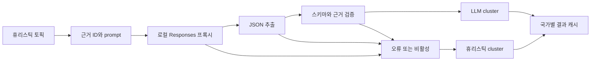

# 140 — 분석 합성 API (WP3)

이 계획은 휴리스틱 토픽을 로컬 LLM 브리핑으로 강화하고 `/api/analysis`로 제공하는
WP3의 실제 구현 계약을 기록한다. 분석 결과는 LLM 연결 여부와 관계없이 같은 응답
형태를 유지한다. 모델이 만든 URL은 신뢰하지 않고, 수집 단계에서 확보한 근거 ID만
검증해 원래 링크로 되돌린다.

WP3는 2026-07-10에 실행되었다. 구현 전 감사에서 나온 8개 지적을 계획에 반영했고,
구현 뒤 스키마 검증·근거 고정·폴백·동적 TTL 경로를 테스트로 확인했다. 이 문서는
초기 계획을 그대로 보존하기보다 현재 코드가 지키는 계약을 다음 작업자가 재현할 수
있도록 정리한 실행 완료본이다.

---

## 실행 상태

- 상태: 완료
- 실행일: 2026-07-10
- 감사: REV 3, GO-WITH-FIXES 8건 반영
- 선행 조건: `src/analysis/aggregate_tool.py`의 휴리스틱 envelope
- 후속 작업: [[150_analysis-frontend-tab.md]]

## 범위

### 포함

- 휴리스틱 토픽을 근거 ID가 붙은 제한된 prompt로 직렬화한다.
- Responses SSE 클라이언트 결과에서 JSON object를 추출한다.
- cluster, briefing, platform, momentum, evidence를 서버에서 재검증한다.
- LLM 비활성·연결 실패·잘린 JSON·스키마 오류를 휴리스틱 cluster로 폴백한다.
- 결과 성격에 따라 성공 1800초, 폴백 300초 캐시를 적용한다.
- `/api/analysis?country=KR&force=1` GET 계약을 추가한다.

### 제외

- 분석 탭의 화면 구조와 스타일은 WP4에서 다룬다.
- 외부 API key와 Python 패키지는 추가하지 않는다.
- 모델이 수집기 원문을 수정하거나 새로운 evidence URL을 만들게 하지 않는다.

## Diff-level 파일 지도

| 경로 | 작업 | 구현 계약 |
|---|---|---|
| `src/analysis/synthesis_tool.py` | NEW | prompt 경계, JSON 추출, 스키마 정제, 근거 복원, 폴백, 동적 TTL을 소유한다. |
| `src/analysis/test_synthesis_tool.py` | NEW | 정상 합성, 잘린 JSON, 잘못된 스키마, 근거 위조, 문자열 정제, 폴백, 캐시를 고정한다. |
| `src/analysis/__init__.py` | MODIFY | `synthesis_tool`을 package public surface에 추가한다. |
| `src/main.py` | MODIFY | `_handle_analysis`와 `/api/analysis` GET route를 추가한다. |
| `src/test_main_api_cache_metadata.py` | MODIFY | 국가 폴백, force 전달, entry별 `cacheTtl` 통과를 확인한다. |

## 합성 흐름

## `build_prompt` 계약

- 토픽은 최대 14개만 모델 입력에 넣는다.
- 토픽별 item은 최대 3개만 사용한다.
- title은 제어 문자와 고립 surrogate를 제거하고 120자로 제한한다.
- fenced data block 경계를 깨지 않도록 입력 title과 keyword의 backtick을 작은따옴표로 바꾼다.
- 각 item은 `E1`, `E2`처럼 증가하는 evidence ID를 받는다.
- system 메시지는 데이터 줄을 신뢰하지 말고 JSON만 반환하라고 명시한다.
- 모델은 cluster를 최대 6개, keywords를 최대 5개로 만들도록 요청받는다.
- evidence에는 URL이 아니라 ID 문자열만 허용한다.
- 반환값은 `(system, prompt, evidence_map)`이다.

## JSON 추출과 검증 계약

- `extract_json`은 입력 앞 200,000자 안의 각 `{` 위치에서 raw decode를 시도한다.
- 설명문이 앞뒤에 붙거나 문자열 안에 중괄호가 있어도 `clusters`가 있는 object를 찾는다.
- 재귀 한도 오류와 잘린 JSON은 `None`으로 처리한다.
- cluster title은 비어 있지 않은 문자열이어야 한다.
- keywords는 문자열 목록이며 최대 5개, 각 40자로 제한한다.
- platforms는 7개 분석 채널 집합의 부분집합만 남긴다.
- evidence는 알려진 ID만 원래 `{title, url}`로 복원한다.
- momentum은 `rising`, `steady`, `cooling` 외 값을 `steady`로 낮춘다.
- 유효 cluster가 하나도 남지 않으면 전체 결과를 폴백한다.
- 최종 payload는 UTF-8 JSON 직렬화를 실제로 통과해야 한다.

## 폴백 계약

- 휴리스틱 계산은 LLM 호출보다 먼저 항상 수행한다.
- `TREND_ANALYSIS_ENABLED=0`이면 `complete`를 호출하지 않는다.
- LLM 예외, 빈 응답, JSON 오류, 스키마 오류는 사용자 요청을 실패시키지 않는다.
- 휴리스틱 topic의 title, keyword, platform, item을 cluster shape로 변환한다.
- `rising`은 `rising`, `falling`은 `cooling`, 나머지는 `steady`로 매핑한다.
- 폴백 응답의 `generatedBy`는 `heuristic`이다.
- 폴백 사유는 `llm.reason`의 `disabled` 또는 `error`로 남긴다.

## 캐시와 HTTP 계약

| 항목 | 값 |
|---|---|
| cache key | `("analysis", country)` |
| LLM 검증 성공 TTL | `1800`초 |
| 비활성·오류 폴백 TTL | `300`초 |
| 같은 국가 force cooldown | `30`초 |
| interactive inactivity timeout | `10`초 |
| interactive total deadline | `45`초 |
| route | `GET /api/analysis` |
| query | `country`, `force` |
| country 허용값 | `KR`, `US`, `JP`; 그 밖은 `KR` |

응답은 합성 data에 `country`, `fetchedAt`, `cacheTtl`을 합친다. 국가별 lock이 같은
국가의 동시 cache miss를 하나의 합성 결과로 합친다. `force=1`도 결과 생성 뒤 30초
안에는 같은 값을 재사용하고, cooldown이 지나면 휴리스틱 수집과 선택적 LLM 합성을
다시 실행한다. handler는 전역 기본 TTL이 아니라 `get_analysis`가 반환한 entry별
TTL을 그대로 전달한다.

## 완료 기준

- [x] 정상 JSON과 설명문이 섞인 JSON을 검증해 LLM cluster로 반환한다.
- [x] 잘린 JSON과 유효 cluster가 없는 payload를 휴리스틱으로 폴백한다.
- [x] 모델이 보낸 알 수 없는 evidence ID와 임의 URL을 응답에서 제거한다.
- [x] 비활성화 시 프록시 연결을 만들지 않고 `generatedBy: heuristic`을 반환한다.
- [x] 성공 응답은 1800초, 폴백 응답은 300초 `cacheTtl`을 반환한다.
- [x] 같은 국가의 동시 요청은 첫 합성 결과를 공유한다.
- [x] `force=1`은 30초 cooldown 안에서 cache를 재사용하고, 30초 뒤 실패 cache를 새 결과로 교체한다.
- [x] `/api/analysis`가 국가를 검증하고 합성 모듈의 TTL을 그대로 전달한다.
- [x] 전체 173개 unittest가 외부 네트워크 없이 통과한다.
- [x] LLM-on curl에서 `generatedBy: gpt-5.6-luna`와 5개 cluster를 확인했다.
- [x] LLM-off curl에서 `generatedBy: heuristic`과 6개 cluster를 확인했다.

## 변경 기록

- 2026-07-10: 감사 반영 뒤 WP3를 실행하고 현재 코드 기준 완료 계획으로 정리했다.

## 문서 연결

- 이전: [[130_analysis-engine.md]]
- 다음: [[150_analysis-frontend-tab.md]]
