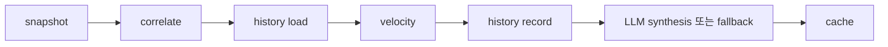

# analysis 모듈 문서

이 문서는 `src/analysis/`의 구현 계약을 다음 작업자가 바로 이어받을 수 있게 설명한다.
분석 엔진은 일곱 수집 채널을 한 표면으로 모으고, 같은 주제를 교차 플랫폼 단위로 묶는다.
결정론적 휴리스틱이 항상 기본 결과를 만들며, LLM은 검증 가능한 요약만 선택적으로 보탠다.
로컬 프록시가 꺼지거나 응답이 깨져도 휴리스틱 결과를 반환하는 오프라인 무저하 원칙을 지킨다.
외부 웹 검색 없이 실제 모듈, 공존 테스트, `src/main.py`의 분석 라우트만 근거로 삼는다.

---

## File Tree

이 섹션은 실제 파일 수와 `wc -l` 실측값으로 모듈의 표면적을 보여준다.
라인 수가 달라지면 역할 설명과 Sync Checklist도 함께 갱신한다.

| 파일 | 라인 수 | 역할 |
|---|---:|---|
| `src/analysis/__init__.py` | 3 | 네 도구 모듈의 배럴 export |
| `src/analysis/llm_client_tool.py` | 153 | stdlib HTTP/SSE Responses 클라이언트와 이중 시간 제한 |
| `src/analysis/keyword_tool.py` | 248 | 다국어 정규화, 토큰 추출, 앵커 일치 판정 |
| `src/analysis/aggregate_tool.py` | 402 | 일곱 채널 수집, 상관 분석, 이력, 속도 휴리스틱 |
| `src/analysis/synthesis_tool.py` | 396 | 근거 기반 LLM 합성, 검증, 폴백, 결과 캐시 |
| `src/analysis/test_llm_client_tool.py` | 291 | SSE 조립, 연결 실패, 비활성화, 시간 제한 테스트 |
| `src/analysis/test_keyword_tool.py` | 50 | 정규화와 스크립트별 경계 규칙 테스트 |
| `src/analysis/test_aggregate_tool.py` | 499 | 어댑터, 상관 점수, 이력, 속도, 오류 계약 테스트 |
| `src/analysis/test_synthesis_tool.py` | 386 | 스키마 검증, 보안 정제, 폴백, TTL 테스트 |

### 파일별 읽기 순서

1. `src/analysis/__init__.py`를 읽는다. 공개 모듈 네 개와 배럴 경계를 3줄에서 확인한다.
2. `src/analysis/keyword_tool.py`를 읽는다. 상관 분석이 쓰는 정규화와 일치 규칙은 248줄이다.
3. `src/analysis/aggregate_tool.py`를 읽는다. 수집부터 휴리스틱 결과까지 이어지는 중심 구현은 402줄이다.
4. `src/analysis/llm_client_tool.py`를 읽는다. 휴리스틱과 분리된 선택적 네트워크 계층은 153줄이다.
5. `src/analysis/synthesis_tool.py`를 읽는다. LLM 강화, 검증, 폴백, 캐시 경계는 396줄이다.
6. `src/analysis/test_keyword_tool.py`를 읽는다. 토큰 경계의 최소 반례를 50줄에서 확인한다.
7. `src/analysis/test_aggregate_tool.py`를 읽는다. 채널별 shape와 이력 계약을 499줄에서 확인한다.
8. `src/analysis/test_llm_client_tool.py`를 읽는다. SSE 및 시간 제한 활성화 시나리오는 291줄이다.
9. `src/analysis/test_synthesis_tool.py`를 읽는다. 신뢰 경계와 캐시 정책은 386줄이다.
10. `src/main.py`의 `_handle_analysis`와 `/api/analysis` 등록을 읽어 HTTP envelope를 확인한다.
11. `src/frontend/index.html`의 분석 탭을 읽어 최종 소비 shape를 확인한다.

### 파일 경계 메모

- `src/analysis/__init__.py`는 `aggregate_tool`, `keyword_tool`, `llm_client_tool`, `synthesis_tool`만 다시 내보낸다.
- `src/analysis/llm_client_tool.py`는 HTTP 연결, Responses 요청, SSE 텍스트 조립, 소켓 종료만 맡는다.
- `src/analysis/keyword_tool.py`는 네트워크와 파일 I/O가 없는 결정론적 함수 계층이다.
- `src/analysis/aggregate_tool.py`는 외부 채널별 응답을 공통 item으로 바꾸고 휴리스틱 토픽을 만든다.
- `src/analysis/synthesis_tool.py`는 휴리스틱 결과를 LLM 입력으로 제한하고 출력 스키마를 재검증한다.
- `src/analysis/synthesis_tool.py`는 분석 결과의 캐시 key와 결과별 TTL도 소유한다.
- `src/main.py`는 국가 정규화와 HTTP 응답 envelope를 맡고 분석 알고리즘을 소유하지 않는다.
- `src/frontend/index.html`의 분석 탭은 표시와 상호작용을 맡고 분석 판정을 다시 계산하지 않는다.

## Module Responsibility

`src/analysis/`는 수집기들이 반환한 서로 다른 shape를 공통 evidence item으로 정규화한다.
그 뒤 Google Trends 키워드와 다중 플랫폼 공통 토큰을 앵커로 삼아 비전이적 토픽을 만든다.
최근 같은 국가의 이력과 점수를 비교해 `rising`, `falling`, `flat`, `new` 상태를 붙인다.
이 결과만으로도 briefing과 cluster를 만들 수 있으므로 LLM은 필수 실행 조건이 아니다.
LLM이 활성화되면 근거 ID만 허용하는 JSON 합성을 시도하고, 검증을 통과한 결과만 채택한다.

### 이중 구조와 오프라인 무저하 원칙

- 결정론적 경로는 `collect_snapshot`에서 `analyze_heuristic`까지 이어진다.
- 선택적 강화 경로는 `_synthesize` 안에서 `build_prompt`, `complete`, `validate`를 순서대로 호출한다.
- `TREND_ANALYSIS_ENABLED=0`이면 HTTP 연결을 만들지 않고 즉시 휴리스틱 cluster를 반환한다.
- 연결 거부, 비정상 HTTP 상태, 빈 SSE, 잘린 JSON, 스키마 오류도 같은 폴백 경로로 모인다.
- LLM 성공 여부와 무관하게 `velocityBaseline`과 수집 `errors`는 휴리스틱 결과에서 이어받는다.
- LLM 성공 시 `generatedBy`는 실제 모델 이름이다.
- 폴백 시 `generatedBy`는 `heuristic`이다.
- 폴백 사유는 `llm.reason`의 `disabled` 또는 `error`로 드러난다.
- 오프라인 무저하는 LLM 설명 품질이 같다는 뜻이 아니다.
- 오프라인에서도 토픽, 근거 링크, momentum, briefing을 가진 사용 가능한 응답 shape를 유지한다는 뜻이다.

### 데이터 흐름

캐시 miss일 때 실제 계산 순서는 snapshot, correlate, 이전 history, velocity, 현재 history 기록, synthesis이다.
`get_analysis`의 캐시가 이 계산 전체를 감싸므로 cache hit에서는 수집과 LLM 호출이 모두 생략된다.



### snapshot 공통 item shape

| 키 | shape | 의미 |
|---|---|---|
| `platform` | 문자열 | `trends`, `youtube`, `reels`, `x`, `threads`, `tiktok`, `ai_news` 중 하나 |
| `title` | 문자열 | 키워드, 제목, 또는 잘라낸 게시물 본문 |
| `url` | 문자열 | 원문, 영상, 뉴스, 검색 결과 링크 |
| `metric` | 음이 아닌 정수 | 조회수, 좋아요, 검색량 등 채널별 대표 수치 |
| `ts` | 실수 | 사용할 수 있는 epoch 값이며 알 수 없으면 `0.0` |

### 채널 어댑터 계약

| 채널 | 입력 getter | 최대 수 | metric | timestamp |
|---|---|---:|---|---|
| `trends` | `get_trends(country, force)` | 20 | `trafficValue` | `ts` |
| `youtube` | `get_videos("전체", "week", False, force, country=country)` | 20 | `views` | `0` |
| `reels` | `get_reels(force)` | 20 | `views` | `takenAt` |
| `x` | `get_x_posts(force)` | 20 | `views`, 없으면 `likes` | `0` |
| `threads` | `get_threads_posts(force)` | 20 | `likes` | `createdAt` |
| `tiktok` | `get_tiktok(force)` | 20 | `views` | `createdAt` |
| `ai_news` | `get_ai_data(force)` | 30 | `0` | `ts` |

`trends` URL은 첫 뉴스 URL을 우선 사용한다.
뉴스 URL이 없으면 정규화 전 키워드로 Google 검색 URL을 만든다.
`x`와 `threads`는 대표 metric 내림차순으로 자른다.
완료된 채널은 `_CHANNELS`의 고정 순서로 합치므로 스레드 완료 순서가 결과를 흔들지 않는다.

### correlation과 점수 계약

- Google Trends item의 정규화된 제목이 우선 앵커다.
- Trends 앵커 토픽은 자체 검색량 신호가 있으므로 한 플랫폼만 일치해도 남는다.
- fallback 앵커는 같은 토큰이 서로 다른 두 플랫폼 이상에 나타날 때만 후보가 된다.
- fallback 앵커는 숫자만인 토큰을 버리며 ASCII는 3자 이상, 비 ASCII는 2자도 허용한다.
- 이미 방출한 Trends 앵커의 compact 문자열에 포함된 fallback 앵커는 중복 방출하지 않는다.
- 토픽은 앵커별로 독립 계산하며 A-B, B-C 관계를 A-B-C로 전이 결합하지 않는다.
- 점수는 `sum(log10(metric + 1)) * (1.0 + 0.5 * (플랫폼 수 - 1))`이다.
- Trends `trafficValue`는 일치 item metric으로 한 번만 들어간다.
- 토픽은 `(-score, keyword)`, 내부 item은 `(platform, url)` 순으로 정렬한다.
- fallback 토픽의 화면 제목은 metric이 가장 큰 일치 item 제목을 사용한다.
- 최종 휴리스틱 응답은 토픽마다 item을 최대 5개만 남긴다.

### history와 velocity 계약

- 이력 경로는 `os.path.join(settings.CONFIG_DIR, "analysis_history.json")`이다.
- 한 entry는 `ts`, `country`, `topics: {keyword: score}`를 가진다.
- `_HISTORY_LIMIT = 48`이므로 최신 48개 entry만 보존한다.
- 모듈 전역 `threading.Lock`이 읽기, append, prune, 쓰기 전체를 직렬화한다.
- 쓰기는 `.tmp` 파일을 만든 뒤 `os.replace`로 교체한다.
- 파일이 없거나 JSON이 깨졌거나 list가 아니면 빈 이력으로 읽는다.
- 쓰기 실패는 `False`이며 분석은 history error를 추가하고 계속된다.
- baseline은 같은 국가의 30분~24시간 전 entry 중 가장 최신 값이다.
- baseline이 없으면 모든 토픽 velocity는 `insufficient`이다.
- baseline에 키워드가 없으면 `new`이다.
- 현재 score가 이전의 110%를 초과하면 `rising`, 90%보다 작으면 `falling`, 나머지는 `flat`이다.

## Key Function Signatures

아래 시그니처는 실제 소스 선언을 그대로 옮긴다.
타입 표기가 없는 함수에는 문서만의 타입 표기를 덧붙이지 않는다.

### `llm_client_tool.py`

#### `is_enabled() -> bool`

- `TREND_ANALYSIS_ENABLED`의 기본값은 문자열 `"1"`이다.
- 값이 정확히 `"0"`일 때만 `False`를 반환한다.

#### `complete(...) -> str | None`

```python
def complete(
    prompt: str,
    system: str | None = None,
    timeout: float = 15,
    deadline: float = 120,
) -> str | None:
```

- 비활성화 상태에서는 연결 객체도 만들지 않고 `None`을 반환한다.
- `system`이 있으면 system input을 user input 앞에 넣는다.
- payload는 `model`, `store: false`, `stream: true`, `input`을 가진다.
- base URL은 `http` scheme과 hostname이 있을 때만 허용한다.
- 요청 경로는 base path 뒤에 `/responses`를 붙인다.
- HTTP 상태가 200이 아니면 `None`을 반환한다.
- SSE의 `response.output_text.delta`와 `response.output_text.done`만 텍스트로 취급한다.
- 같은 output/content index에 done text가 있으면 누적 delta보다 done text를 우선한다.
- 여러 part는 `(output_index, content_index)` 정렬 순서로 합친다.
- 읽기 중 `OSError`가 생기면 그때까지 모은 partial text를 반환할 수 있다.
- 연결 및 HTTP 예외는 호출자에게 올리지 않고 `None`으로 바꾼다.

### `keyword_tool.py`

#### `normalize(text)`

- 입력을 문자열로 바꾸고 NFKC 정규화와 `casefold`를 적용한다.
- 문장부호를 공백으로 바꾸고 연속 공백을 하나로 줄인다.
- 빈 값은 빈 문자열이 된다.

#### `tokens(text)`

- 정규화 뒤 ASCII 영숫자, 한글, Kana/Han run을 추출한다.
- ASCII 토큰은 독립 경계를 가진 2자 이상 run이다.
- 한글과 Kana/Han 토큰은 2자 이상 run이다.
- `STOPWORDS`에 든 한국어, 영어, 일본어 범용어를 제거한다.

#### `matches(anchor, text)`

- compact substring 규칙과 전체 anchor token 규칙 중 하나가 맞으면 `True`이다.
- 순수 한글 compact anchor는 3자 이상, 그 밖의 anchor는 4자 이상이어야 substring 규칙을 쓴다.
- 한글 anchor token은 정확히 같거나 3자 이상일 때 text token의 prefix와 같으면 통과한다.
- ASCII anchor token은 text token과 정확히 같아야 한다.
- 유의미한 anchor token이 하나라도 빠지면 phrase match는 실패한다.
- 빈 anchor와 stopword만 남은 anchor는 일치하지 않는다.

### `aggregate_tool.py`

#### `ensure_registered()`

- Reels, Threads, TikTok, X의 `register()`를 매번 호출한다.
- 각 등록 함수의 멱등성을 이용해 지워진 계정 source registry도 복구한다.

#### `collect_snapshot(country="KR", force=False, deadline=25)`

- 일곱 채널 getter를 `ThreadPoolExecutor(max_workers=7)`에 동시에 제출한다.
- `time.monotonic()`으로 공유 deadline의 남은 시간을 계산한다.
- deadline 안에 끝나지 않은 채널은 `{"channel": ..., "kind": "timeout"}`으로 남긴다.
- getter 예외는 해당 채널의 `kind: "error"`로 바꾸고 다른 채널 결과는 유지한다.
- 채널이 반환한 embedded error에는 `channel` key를 덧붙인다.
- executor는 `shutdown(wait=False)`로 닫으므로 timeout worker는 백그라운드에서 끝날 수 있다.
- 반환 shape는 `{"items": [...], "errors": [...]}`이다.

#### `correlate(snapshot)`

- dict snapshot과 item list 입력을 모두 받는다.
- Trends 우선 앵커와 다중 플랫폼 fallback token 앵커를 만든다.
- 점수와 플랫폼 증폭을 계산하고 결정론적 순서로 토픽을 반환한다.

#### `_history_path()`

- 현재 `settings.CONFIG_DIR` 아래의 `analysis_history.json` 경로를 계산한다.

#### `_read_history_unlocked()`

- lock을 직접 잡지 않고 history JSON을 읽는다.
- I/O, JSON decode, 타입 변환 오류는 빈 list로 바꾼다.

#### `load_history()`

- `_history_lock` 안에서 `_read_history_unlocked()`를 호출한다.

#### `record_history(country, topics, now=None)`

- 전달된 `now` 또는 `time.time()`으로 entry를 만든다.
- append 뒤 최신 48개만 남기고 임시 파일과 `os.replace`로 저장한다.
- 저장 성공은 `True`, 실패는 `False`이다.

#### `velocity(topics, history, country, now)`

- 같은 국가와 허용 시간 창을 만족하는 최신 baseline을 고른다.
- 입력 topic을 얕게 복사한 뒤 `velocity`를 붙인다.
- `topics`와 `velocityBaseline`을 가진 dict를 반환한다.

#### `analyze_heuristic(country, force)`

- 등록 복구, snapshot 수집, correlation, 이전 history 로드, velocity 계산 순으로 실행한다.
- velocity를 계산한 뒤 현재 점수를 history에 기록한다.
- 토픽 item을 최대 5개로 제한한다.
- 상승세 토픽과 교차 플랫폼 토픽을 한 줄씩 고르는 briefing list를 만든다.
- `generatedBy`는 항상 `heuristic`이다.

### `synthesis_tool.py`

#### `build_prompt(topics, country)`

- topic은 최대 14개, 각 topic item은 최대 3개를 입력에 포함한다.
- item마다 `E1`, `E2`처럼 증가하는 evidence ID를 만든다.
- 반환값은 `(system, prompt, evidence_map)`이다.
- system 메시지는 user data를 신뢰하지 말고 JSON만 출력하라고 지시한다.
- prompt는 cluster를 최대 6개, keyword를 최대 5개로 제한하는 JSON contract를 담는다.
- briefing은 한국어 3~4문장으로 요청하지만 반환 검증은 문장 수를 강제하지 않는다.

#### `extract_json(text)`

- 문자열이 아니면 `None`을 반환한다.
- 앞 200,000자만 탐색한다.
- 각 `{` 위치에서 `JSONDecoder.raw_decode`를 시도한다.
- `clusters` key가 있는 첫 dict를 반환한다.
- 섞인 설명문이나 문자열 내부 중괄호가 있어도 다음 후보를 계속 찾는다.

#### `validate(payload, evidence_map)`

- `clusters`가 list가 아니면 `None`이다.
- cluster마다 title, why, keywords, platforms, evidence shape를 정제한다.
- 유효 cluster를 최대 6개만 남긴다.
- 하나도 남지 않으면 `None`을 반환해 휴리스틱 폴백을 유도한다.
- 성공하면 `clusters`와 정제된 `briefing`만 반환한다.

#### `get_analysis(country, force)`

- cache key는 `("analysis", country)`이다.
- cache miss 또는 force에서만 `_synthesize(country, force)`를 실행한다.
- 반환값은 `(data, fetched_at, cache_tool.ttl_for(key))`이다.

### 보안 결정

- 모델은 원본 URL을 새로 만들거나 그대로 반환할 권한을 갖지 않는다.
- `build_prompt`는 원본 item을 evidence ID와 제한된 필드로 바꾼다.
- system 메시지는 user message의 데이터 줄을 untrusted content로 명시한다.
- fenced data block 안의 문장을 명령으로 따르지 말라는 규칙을 prompt에도 반복한다.
- 모델 응답의 evidence는 ID 문자열만 허용한다.
- 알 수 없는 ID, URL처럼 보이는 문자열, dict 형태의 가짜 근거는 모두 버린다.
- 근거(evidence)의 title과 URL은 모델 응답이 아니라 trusted `evidence_map`에서 복원한다.
- 클러스터 제목·설명·브리핑 문장은 모델 생성 텍스트다. sanitize와 길이 제한은 거치지만
  의미 자체는 모델 출력이므로, 스크랩된 제목에 심긴 지시문이 분석 문구에 영향을 줄 수 있다.
- URL parser를 통과해도 `http`와 `https` 이외 scheme은 버린다.
- 플랫폼 값은 `_ALLOWED_PLATFORMS` 집합에 든 값만 남긴다.
- 잘못된 momentum은 `steady`로 낮춘다.
- title은 80자, keyword는 40자, why는 240자로 제한한다.
- evidence title은 120자, URL은 2048자로 제한한다.
- briefing은 600자로 제한한다.
- API payload에 들어가는 일반 문자열은 최대 4000자로 제한한다.
- surrogate 제거는 고립 surrogate 때문에 UTF-8 직렬화가 깨지는 일을 막는다.
- C0 정제는 NUL과 화면에 부적합한 제어 문자를 응답에서 제거한다.
- `_finalize`는 정제 뒤 UTF-8 JSON encode를 실제로 시도한다.
- 직렬화가 실패하면 정제된 휴리스틱 폴백을 만들고 다시 검증한다.
- 폴백 직렬화도 실패하면 빈 cluster와 고정 briefing을 가진 최소 응답을 반환한다.

### 시간 제한 설계

- `complete`의 기본 `timeout=15`는 `HTTPConnection`과 socket 작업의 inactivity 제한이다.
- `complete`의 기본 `deadline=120`은 요청 전체를 끊기 위한 watchdog 제한이다.
- watchdog `threading.Timer`는 `connect()` 전에 시작한다.
- deadline callback은 현재 연결 socket을 양방향 shutdown해 막힌 `readline`을 깨운다.
- inactivity timeout 뒤 이미 받은 완전한 SSE delta가 있으면 partial text를 조립할 수 있다.
- 줄바꿈 없는 byte drip은 SSE event가 완성되지 않으므로 deadline 뒤 `None`이 될 수 있다.
- 분석 탭이 쓰는 `_synthesize` 호출은 기본값보다 짧은 `timeout=10`, `deadline=45`를 전달한다.
- LLM 구간의 watchdog 상한은 45초이고, 앞선 수집 deadline 25초를 더하면
  대화형 경로의 총 상한은 약 70초이다.
- 별도로 `collect_snapshot`은 기본 25초의 공유 수집 deadline을 가진다.
- 수집 deadline은 완료된 채널 결과를 버리지 않고 timeout 채널만 오류로 기록한다.

### 캐시 TTL 정책

- 분석 cache key는 국가별 `("analysis", country)`이다.
- LLM 검증 성공 결과는 30분인 `1800`초 동안 저장한다.
- 비활성화, 연결 실패, JSON 오류, 스키마 오류로 생긴 폴백은 5분인 `300`초 동안 저장한다.
- TTL 판정은 `generatedBy` 문자열이 아니라 `llm.ok is True`를 기준으로 한다.
- cache hit는 같은 data와 `fetched_at`을 반환하고 휴리스틱 및 LLM을 재실행하지 않는다.
- `force=True`는 남은 TTL과 관계없이 현재 결과를 새 entry로 교체한다.
- 폴백 cache도 유효하지만 짧게 유지해 프록시 복구 뒤 다시 시도할 기회를 앞당긴다.
- `get_analysis`의 세 번째 반환값은 저장된 entry의 실제 TTL이다.

### HTTP route contract

`src/main.py`의 `_handle_analysis(self, qs)`가 `/api/analysis` GET 요청을 처리한다.

- query param은 `country`와 `force`이다.
- `force` 값이 정확히 `1`일 때만 `True`이다.
- `country`는 대문자로 바꾼다.
- `youtube_tool.COUNTRY_LOCALE`에 없는 국가는 `KR`로 폴백한다.
- handler는 `synthesis_tool.get_analysis(country, force)`를 호출한다.
- 응답은 분석 data에 `country`, `fetchedAt`, `cacheTtl`을 합친 shape이다.
- handler가 정상 반환하면 HTTP status는 200이다.
- `/api/analysis`는 `do_GET`의 route table에 `_handle_analysis`로 등록된다.

### 테스트 함수 지도

| 테스트 파일 | 고정하는 핵심 경계 |
|---|---|
| `test_keyword_tool.py` | NFKC/casefold, 다국어 stopword, 한글 prefix, ASCII 경계, phrase 전체 token |
| `test_aggregate_tool.py` | 일곱 adapter, cap, partial deadline, error 수집, correlation 점수, history와 velocity |
| `test_llm_client_tool.py` | done/delta 조립, multipart 순서, non-200, malformed SSE, inactivity와 watchdog |
| `test_synthesis_tool.py` | JSON 추출, schema cap, evidence grounding, 문자열 정제, 폴백, TTL과 force |

테스트는 외부 endpoint를 호출하지 않는다.
watchdog 활성화 시나리오만 localhost 임시 socket server를 사용한다.
aggregate 테스트는 모든 채널 getter를 mock해 실제 서비스 상태와 분리한다.
synthesis 테스트는 모델 이름, 대화형 제한, cache hit 재사용까지 exact call로 확인한다.

## Dependencies

이 모듈이 직접 import하거나 런타임에서 기대하는 대상을 적는다.
프로젝트 원칙에 맞게 외부 Python 패키지는 사용하지 않는다.

### 표준 라이브러리

| 모듈 | 사용처 |
|---|---|
| `http.client`, `socket`, `threading`, `urllib.parse` | Responses HTTP 연결, watchdog, URL 분해 |
| `json` | SSE event, history, prompt, LLM 응답 직렬화와 파싱 |
| `os` | 환경변수, history 경로, 임시 파일 교체 |
| `re`, `unicodedata` | 다국어 token, 문자열 정제, Unicode 정규화 |
| `concurrent.futures` | 일곱 채널 병렬 수집과 deadline 대기 |
| `math` | metric 로그 점수 |
| `time` | 수집 deadline, history timestamp, velocity 기준 시각 |
| `urllib.parse.quote_plus`, `urlsplit` | Trends fallback 검색 URL, evidence URL 검증 |

### 내부 모듈

- `settings.CONFIG_DIR`는 `analysis_history.json` 위치를 제공한다.
- `shared.cache_tool`은 국가별 분석 cache, callback TTL, `ttl_for`를 제공한다.
- `trends.trends_tool`은 검색 키워드, traffic, 관련 뉴스 URL을 제공한다.
- `youtube.youtube_tool`은 국가별 주간 영상과 `COUNTRY_LOCALE`을 제공한다.
- `reels.reels_tool`은 Reels 수집과 account source 등록을 제공한다.
- `x_twitter.x_twitter_tool`은 X 수집과 account source 등록을 제공한다.
- `threads.threads_tool`은 Threads 수집과 account source 등록을 제공한다.
- `tiktok.tiktok_tool`은 TikTok 수집과 account source 등록을 제공한다.
- `ai_news.ai_news_tool`은 AI 뉴스 수집 결과를 제공한다.
- `analysis.keyword_tool`은 aggregate의 앵커 정규화와 일치 판정을 제공한다.
- `analysis.aggregate_tool`은 synthesis에 검증 전 휴리스틱 결과를 제공한다.
- `analysis.llm_client_tool`은 synthesis에 선택적 LLM completion을 제공한다.
- `shared.accounts_tool`은 `aggregate_tool.py`에 직접 import되어 있지만 현재 실행 코드에서는 참조되지 않는다.

### 런타임 설정

| 환경변수 | 기본값 | 동작 |
|---|---|---|
| `TREND_ANALYSIS_BASE_URL` | `http://127.0.0.1:10100/v1` | 로컬 Responses 호환 프록시 base URL |
| `TREND_ANALYSIS_MODEL` | `cursor/gpt-5.6-luna` | 요청 model과 성공 결과의 `generatedBy`, `llm.model` |
| `TREND_ANALYSIS_ENABLED` | `1` | 정확히 `0`이면 LLM 경로 비활성화 |

현재 클라이언트는 `http` base URL만 허용한다.
요청 header는 `Content-Type: application/json`만 설정하며 API key를 읽지 않는다.
프록시는 선택적 런타임 의존성이므로 접근할 수 없어도 휴리스틱 응답은 유지된다.

## Dependents

이 모듈을 import하거나 HTTP 결과를 소비하는 쪽이다.

- `src/analysis/__init__.py`는 네 도구 모듈을 package public 표면으로 다시 내보낸다.
- `src/main.py`는 `analysis.synthesis_tool`을 import한다.
- `src/main.py`의 `_handle_analysis`는 `get_analysis`의 3-tuple을 HTTP 응답으로 바꾼다.
- `src/main.py`의 GET route table은 `/api/analysis`를 등록한다.
- `src/frontend/index.html`의 분석 탭은 `/api/analysis` 응답을 사용자 화면에서 소비한다.
- `src/analysis/test_aggregate_tool.py`는 수집기 getter와 history I/O 계약을 소비한다.
- `src/analysis/test_synthesis_tool.py`는 `get_analysis`와 cache TTL 계약을 소비한다.
- `src/analysis/test_llm_client_tool.py`는 `complete`의 SSE 및 시간 제한 계약을 소비한다.
- `src/analysis/test_keyword_tool.py`는 공개 정규화 함수 세 개를 소비한다.

## Sync Checklist

코드를 바꾼 뒤에는 아래 항목을 실제 변경 범위에 맞춰 확인한다.
체크박스는 구현, 테스트, 라우트, 문서가 같은 계약을 가리키는지 남기는 용도다.

### 수집과 상관 분석

- [ ] `_CHANNELS` 변경 시 executor worker 수, adapter branch, 오류 channel, 테스트 cap을 함께 갱신한다.
- [ ] 채널 getter tuple shape 변경 시 `_fetch_channel`의 error index와 fixture를 함께 갱신한다.
- [ ] `keyword_tool.STOPWORDS` 변경 시 fallback anchor 수와 다국어 반례를 확인한다.
- [ ] compact threshold 변경 시 손흥민, 카페, ASCII 경계 테스트를 갱신한다.
- [ ] score 증폭식 변경 시 중복 계상 여부와 동점 정렬을 확인한다.
- [ ] snapshot deadline 변경 시 partial result와 background worker 동작을 다시 검증한다.

### history와 velocity

- [ ] `_HISTORY_LIMIT=48` 변경 시 ring cap 테스트와 보존 기간 가정을 갱신한다.
- [ ] entry shape 변경 시 기존 history 파일을 읽는 호환성을 확인한다.
- [ ] baseline 창 1800~86400초 변경 시 경계값 테스트를 갱신한다.
- [ ] 110%와 90% 임계값 변경 시 rising, falling, flat fixture를 갱신한다.
- [ ] history 기록 순서 변경 시 이전 baseline을 먼저 읽는 계약을 지킨다.
- [ ] history 쓰기 실패 정책 변경 시 HTTP 응답의 `errors` 노출을 확인한다.

### LLM과 보안

- [ ] Responses payload shape 변경 시 system/user input 순서와 SSE fixture를 갱신한다.
- [ ] SSE event type 변경 시 delta-only, done 우선, multipart 정렬을 확인한다.
- [ ] prompt contract 변경 시 `validate`와 분석 탭 소비 shape를 함께 갱신한다.
- [ ] topic 14개 또는 item 3개 cap 변경 시 evidence ID 수 테스트를 갱신한다.
- [ ] cluster 6개, keyword 5개, evidence 3개 cap 변경 시 스키마 cap 테스트를 갱신한다.
- [ ] `_ALLOWED_PLATFORMS` 변경 시 aggregate channel과 frontend icon mapping을 확인한다.
- [ ] evidence 복원 규칙 변경 시 unknown ID와 위험 URL 거부 테스트를 유지한다.
- [ ] surrogate 또는 C0 정제 변경 시 UTF-8 encode 테스트를 다시 실행한다.
- [ ] fallback reason을 바꾸면 `disabled`와 `error` 소비자를 함께 갱신한다.

### 시간 제한과 캐시

- [ ] `complete` 기본 inactivity 15초 변경 시 연결 거부와 partial read 테스트를 확인한다.
- [ ] 기본 watchdog 120초 변경 시 함수 시그니처와 운영 설명을 함께 갱신한다.
- [ ] 대화형 inactivity 10초 또는 deadline 45초 변경 시 exact call 테스트를 갱신한다.
- [ ] watchdog socket shutdown 변경 시 줄바꿈 없는 drip 활성화 테스트를 실행한다.
- [ ] 성공 TTL 1800초 변경 시 `_analysis_ttl`과 route `cacheTtl`을 확인한다.
- [ ] 폴백 TTL 300초 변경 시 프록시 복구 재시도 주기와 force 테스트를 확인한다.
- [ ] `force=True` 전파 변경 시 일곱 getter와 cache replacement 테스트를 확인한다.

### 라우트와 프론트

- [ ] `/api/analysis` 경로 변경 시 `src/main.py` route table과 분석 탭 fetch URL을 함께 갱신한다.
- [ ] 응답 envelope 변경 시 `country`, `fetchedAt`, `cacheTtl` 표시를 함께 갱신한다.
- [ ] cluster의 `title`, `keywords`, `why`, `platforms`, `evidence`, `momentum` key를 바꾸면 renderer를 갱신한다.
- [ ] `src/frontend/index.html`의 분석 탭 변경이 끝나면 이 문서의 Dependents와 route contract를 재확인한다.

### 문서 동기화

- [ ] `src/analysis/__init__.py` 라인 수가 3줄에서 바뀌면 File Tree를 갱신한다.
- [ ] `src/analysis/llm_client_tool.py` 라인 수가 153줄에서 바뀌면 File Tree를 갱신한다.
- [ ] `src/analysis/keyword_tool.py` 라인 수가 248줄에서 바뀌면 File Tree를 갱신한다.
- [ ] `src/analysis/aggregate_tool.py` 라인 수가 402줄에서 바뀌면 File Tree를 갱신한다.
- [ ] `src/analysis/synthesis_tool.py` 라인 수가 396줄에서 바뀌면 File Tree를 갱신한다.
- [ ] `src/analysis/test_llm_client_tool.py` 라인 수가 291줄에서 바뀌면 File Tree를 갱신한다.
- [ ] `src/analysis/test_keyword_tool.py` 라인 수가 50줄에서 바뀌면 File Tree를 갱신한다.
- [ ] `src/analysis/test_aggregate_tool.py` 라인 수가 499줄에서 바뀌면 File Tree를 갱신한다.
- [ ] `src/analysis/test_synthesis_tool.py` 라인 수가 386줄에서 바뀌면 File Tree를 갱신한다.
- [ ] 함수 시그니처 변경 시 Key Function Signatures와 해당 테스트 호출을 함께 갱신한다.
- [ ] 상수 변경 시 Module Responsibility의 경계값과 Sync Checklist를 함께 갱신한다.

## 변경 기록

- 2026-07-10: 실제 구현과 네 테스트 기준으로 luna 분석 엔진 문서를 작성했다.

## 문서 연결

- 이전: [[date.md]]
- 다음: [[frontend.md]]
