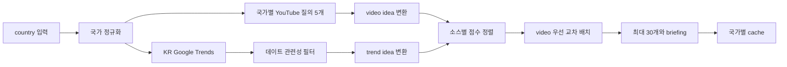

# date 모듈 문서

`src/date/`는 이번 주에 참고할 데이트 코스 후보를 기존 무인증 수집기로 만든다.
새로운 외부 API나 별도 계정을 요구하지 않는다. YouTube 검색 결과를 중심으로 두고,
한국에서는 Google Trends 급상승 검색어 가운데 데이트 맥락이 분명한 항목을 보탠다.

영상 조회수와 검색량은 단위와 분포가 다르다. 두 값을 한 점수로 억지로 합치면
검색량이 큰 급상승어가 영상을 밀어내거나, 누적 조회수가 큰 영상이 실시간 관심사를
가릴 수 있다. 이 모듈은 각 소스 안에서만 점수순으로 정렬한 뒤 영상과 트렌드를
한 건씩 교차 배치한다. 화면은 두 신호를 함께 보여주되 서로 직접 비교하지 않는다.

국가 선택은 YouTube 검색어와 locale을 함께 바꾼다. 한국은 서울·주말·실내·전시·맛집
질의를 사용한다. 미국과 일본은 같은 의도를 현지어 검색어로 바꾼다. Google Trends
보강은 한국에서만 실행한다. 지원하지 않는 국가 값은 서버와 모듈 양쪽에서 `KR`로
정규화한다.

수집이 완전히 실패하거나 빈 결과와 오류가 함께 생기면 정상 캐시 시간만큼 기다리지
않는다. 실패 결과는 120초만 저장해 외부 서비스가 회복된 뒤 빠르게 다시 시도한다.
일부 질의만 실패하고 다른 후보가 남으면 사용할 수 있는 결과와 오류 목록을 함께
반환한다.

---

## File Tree

라인 수는 `wc -l src/date/*.py`로 확인한 실제 값이다.
구현이나 테스트가 바뀌면 이 표와 아래 동기화 체크를 같이 갱신한다.

| 파일 | 라인 수 | 역할 |
|---|---:|---|
| `src/date/__init__.py` | 1 | date package marker |
| `src/date/date_tool.py` | 199 | 국가별 질의, 수집, 변환, 교차 배치, 결과별 TTL |
| `src/date/test_date_tool.py` | 172 | 병렬 수집, 관련성, 국가, 실패, 캐시 회귀 테스트 |

### 파일 경계 메모

- `src/date/__init__.py`는 실행 로직이나 배럴 export를 만들지 않는다.
- `src/date/date_tool.py`는 날짜·예약·장소 DB를 소유하지 않는다.
- `src/date/date_tool.py`는 기존 YouTube와 Trends 수집기를 조합한다.
- YouTube endpoint와 payload 계약은 `src/youtube/youtube_tool.py`가 소유한다.
- Google Trends RSS 파싱은 `src/trends/trends_tool.py`가 소유한다.
- 메모리 캐시 구현과 전역 기본 TTL은 `src/shared/cache_tool.py`가 소유한다.
- `src/main.py`는 query 검증과 HTTP response envelope만 소유한다.
- `src/frontend/index.html`은 카드 표시와 탭 상태만 소유한다.
- 이 모듈은 외부 Python package를 import하지 않는다.
- 이 모듈은 로컬 파일을 직접 읽거나 쓰지 않는다.

## Module Responsibility

`date` 모듈의 책임은 여러 데이트 검색어를 동시에 조회하고, 화면에서 비교 가능한
idea shape로 정규화하고, 서로 다른 두 신호를 소스별 순위를 보존한 채 섞는 일이다.
후보가 실제 영업 중인지, 예약 가능한지, 사용자의 위치에서 가까운지는 판단하지 않는다.

### 소유하는 책임

- `KR`, `US`, `JP`별 데이트 검색어와 화면 tag를 정의한다.
- 지원하지 않는 국가를 `KR`로 정규화한다.
- 국가별 YouTube 질의 5개를 병렬 실행한다.
- 한국 요청에서만 Google Trends RSS 수집을 함께 실행한다.
- YouTube video를 공통 idea shape로 바꾼다.
- 관련성이 확인된 Trends item을 공통 idea shape로 바꾼다.
- source 안에서 score 내림차순으로 정렬한다.
- video와 trend idea를 video 우선 1:1 순서로 섞는다.
- URL과 ID 기준으로 중복을 제거한다.
- 최대 30개 idea와 고정 briefing 두 줄을 반환한다.
- source 오류를 사용자 응답에 포함할 수 있는 dict로 정규화한다.
- 전체 실패 결과에 120초 TTL을 선택한다.
- 국가별 cache key와 `force` 전달을 소유한다.

### 데이터 흐름



### 국가별 질의 계약

각 국가는 다섯 개의 `(query, tags)` tuple을 가진다.
query는 YouTube 검색에 사용하고 tags는 결과 카드에 그대로 붙인다.

| 국가 | query | tags |
|---|---|---|
| KR | `서울 데이트 코스` | `서울`, `코스` |
| KR | `주말 데이트 추천` | `주말`, `추천` |
| KR | `실내 데이트` | `실내`, `비오는날` |
| KR | `전시 데이트` | `전시`, `문화` |
| KR | `맛집 데이트` | `맛집`, `식사` |
| US | `date ideas` | `date ideas`, `romantic` |
| US | `weekend date ideas` | `weekend`, `date ideas` |
| US | `indoor date ideas` | `indoor`, `date ideas` |
| US | `romantic restaurants` | `restaurant`, `romantic` |
| US | `museum date` | `museum`, `culture` |
| JP | `デート スポット` | `デート`, `スポット` |
| JP | `週末 デート` | `週末`, `デート` |
| JP | `室内デート` | `室内`, `デート` |
| JP | `美術館 デート` | `美術館`, `文化` |
| JP | `ディナー デート` | `ディナー`, `食事` |

### 수집 동시성

- `worker_count`는 YouTube 질의 수에 KR Trends worker 수를 더한다.
- KR은 6개 worker를 사용한다.
- US와 JP는 5개 worker를 사용한다.
- 각 YouTube 질의는 독립 future다.
- YouTube future에는 query와 tags를 같이 보관한다.
- KR Trends future는 YouTube future와 같은 executor에서 실행한다.
- `with ThreadPoolExecutor(...)`를 사용하므로 함수 반환 전에 worker가 정리된다.
- 각 YouTube future 결과는 최대 6개만 사용한다.
- 다섯 질의가 모두 채워져도 video 후보는 최대 30개다.
- Trends 후보를 섞은 뒤 최종 결과를 다시 `MAX_IDEAS=30`으로 자른다.

### YouTube idea shape

| 키 | 값과 출처 |
|---|---|
| `id` | `yt:` + video id; id가 없으면 query와 rank를 조합하지만 최종 수집에서 제외 |
| `source` | 고정 문자열 `YouTube` |
| `type` | 고정 문자열 `video` |
| `title` | video title, 없으면 query |
| `url` | `https://www.youtube.com/watch?v=` + video id |
| `thumbnail` | video thumbnail, 없으면 빈 문자열 |
| `account` | channel, 없으면 빈 문자열 |
| `published` | 상대 게시 시각, 없으면 빈 문자열 |
| `metric` | 화면용 `viewsText`, 없으면 빈 문자열 |
| `score` | 정렬용 정수 `views` |
| `tags` | 국가별 query에 연결된 tag list |
| `query` | 이 영상을 가져온 검색어 |

### Google Trends idea shape

| 키 | 값과 출처 |
|---|---|
| `id` | `trend:` + keyword |
| `source` | 고정 문자열 `Google Trends` |
| `type` | 고정 문자열 `trend` |
| `title` | keyword; 없으면 `데이트 트렌드` |
| `url` | 첫 news URL, 없으면 Google 검색 URL |
| `thumbnail` | trend picture, 없으면 첫 news picture |
| `account` | 첫 news source |
| `published` | 빈 문자열 |
| `metric` | 화면용 traffic 문자열 |
| `score` | 정렬용 정수 `trafficValue` |
| `tags` | `급상승`, `관심사` |
| `query` | keyword |

### Trends 관련성 규칙

Google Trends의 모든 급상승어를 데이트 후보로 쓰지 않는다.
`_is_date_related`는 공백 제거와 `casefold` 뒤 아래 규칙을 적용한다.

- `업데이트`에서 나온 `데이트` 부분 문자열은 제거한다.
- 남은 compact 문자열에 `데이트`가 있으면 바로 허용한다.
- 직접 `데이트`가 없으면 활동어와 맥락어가 각각 하나 이상 필요하다.
- 활동어는 전시, 팝업, 맛집, 카페, 축제, 공연, 여행, 핫플, 나들이다.
- 맥락어는 커플, 연인, 로맨틱, 기념일, 소개팅, 둘이다.
- `커플 전시 추천`은 활동어와 맥락어가 모두 있어 허용한다.
- `일본 여행`은 활동어만 있어 거부한다.
- `지역 카페 휴무 뉴스`는 활동어만 있어 거부한다.
- `앱 업데이트 소식`은 `업데이트` 오탐을 제거해 거부한다.

### 정렬과 교차 배치

`_interleave_ideas`는 입력 list를 직접 수정하지 않고 새 정렬 list를 만든다.

- video idea는 `score` 내림차순으로 정렬한다.
- trend idea도 `score` 내림차순으로 정렬한다.
- 같은 rank에서는 video를 먼저 넣는다.
- 그 다음 같은 rank의 trend를 넣는다.
- 한쪽 list가 먼저 끝나면 다른 쪽의 남은 항목을 계속 넣는다.
- video score와 trend score를 서로 비교하지 않는다.
- score가 없거나 falsy면 `0`으로 취급한다.
- 최종 cap은 `_fetch_date_radar`가 적용한다.

예를 들어 video score가 `1000`, `10`이고 trend score가 `100000`, `1`이면 순서는
`strong video`, `strong trend`, `weak video`, `weak trend`가 된다. 검색량 100000이
조회수 1000보다 앞선다고 가정하지 않는다.

### 오류 계약

| 상황 | `errors` 항목 |
|---|---|
| YouTube query future 예외 | `{"kind":"youtube","query":...,"error":예외 클래스명}` |
| 모든 YouTube 결과가 비고 query 예외도 없음 | `{"kind":"youtube","error":"EmptyResult"}` |
| Trends future 자체 예외 | 원본 country와 예외 클래스명을 Trends 오류로 변환 |
| Trends 수집기가 오류 list 반환 | 각 오류의 `kind`를 `error`로 옮기고 `kind:"trends"` 부여 |
| 일부 source 실패, idea 존재 | idea와 errors를 함께 반환 |
| 모든 source 실패, idea 없음 | 빈 idea와 errors를 반환하고 120초 TTL 사용 |

YouTube 질의 하나의 예외는 다른 질의 결과를 버리지 않는다.
Trends 오류도 YouTube 후보를 버리지 않는다. 부분 결과가 있으면 사용자에게 후보를
보여주고, errors는 API 응답에 남아 진단에 사용할 수 있다.

### briefing 계약

현재 briefing은 국가나 결과 개수에 따라 달라지지 않는 두 문장이다.

1. 영상 조회수와 검색 급상승 신호로 후보를 정렬했다는 문장
2. 실내·전시·맛집·주말 코스를 상황에 맞게 고를 수 있다는 문장

수집 결과가 비어도 briefing list는 반환한다.
프론트엔드는 각 문자열을 별도 paragraph로 렌더한다.

## Key Function Signatures

아래 선언은 `src/date/date_tool.py`의 실제 함수 시그니처를 따른다.
underscore 함수도 테스트와 데이터 계약에서 중요하므로 함께 기록한다.

### `_normalize_country(country: str) -> str`

- falsy 입력은 `KR`로 바꾼다.
- 문자열을 대문자로 바꾼다.
- `youtube_tool.COUNTRY_LOCALE`에 있는 값만 유지한다.
- 지원하지 않는 값은 `KR`을 반환한다.
- module cache key가 허용 국가만 사용하게 만든다.

### `_score_video(video: dict) -> int`

- `video["views"]`를 정수로 변환한다.
- views가 없거나 falsy면 `0`을 사용한다.
- 변환할 수 없는 문자열은 현재 예외를 일으킬 수 있다.
- 이 함수의 결과는 source 내부 순위에만 사용한다.

### `_video_idea(video: dict, query: str, tags: tuple, rank: int) -> dict`

- YouTube parser shape를 date idea shape로 변환한다.
- video id가 있으면 안정적인 `yt:` ID와 watch URL을 만든다.
- caller가 id 없는 결과를 최종 list에 넣지 않는다.
- tuple tags는 새 list로 복사한다.
- title fallback은 현재 query다.
- rank는 id가 없을 때 임시 ID를 만드는 데만 사용한다.

### `_trend_idea(trend: dict) -> dict`

- 첫 news item을 link와 source fallback으로 사용한다.
- news가 없으면 Google 검색 URL을 만든다.
- picture는 trend 자체 이미지를 우선한다.
- traffic과 trafficValue를 표시값과 정렬값으로 분리한다.
- Trends item에는 고정 tag 두 개를 붙인다.

### `_is_date_related(keyword: str) -> bool`

- 공백을 제거하고 대소문자 차이를 없앤다.
- `업데이트` 오탐을 방어한다.
- 직접 데이트 언급 또는 활동어와 맥락어 조합만 허용한다.
- 형태소 분석이나 의미 임베딩은 사용하지 않는다.
- 순수 문자열 포함 규칙이므로 동의어를 모두 포착하지 못할 수 있다.

### `_interleave_ideas(video_ideas: list, trend_ideas: list) -> list`

- 두 source를 독립적으로 score 내림차순 정렬한다.
- 같은 rank의 video, trend 순서로 새 list를 만든다.
- 서로 다른 metric을 하나의 숫자로 합치지 않는다.
- 길이가 다른 list도 모든 항목을 보존한다.

### `_fetch_date_radar(country: str)`

- 정규화가 끝난 country를 받는 내부 fetch 함수다.
- `DATE_QUERIES_BY_COUNTRY[country]`를 직접 조회한다.
- YouTube 5개와 선택적 KR Trends를 병렬 실행한다.
- 각 YouTube 결과는 6개로 제한한다.
- video id와 중복 URL을 검증한다.
- Trends 오류 shape를 date 오류 shape로 바꾼다.
- 관련성이 있는 Trends item만 변환한다.
- 최대 30개 idea, briefing 두 줄, errors를 가진 dict를 반환한다.

### `get_date_radar(country: str = "KR", force: bool = False)`

- module의 공개 진입점이다.
- country를 `_normalize_country`로 정규화한다.
- cache key는 `("date_radar", country)`이다.
- `force=True`면 유효한 cache entry도 무시한다.
- `cache_tool.cached`에 결과별 TTL selector를 전달한다.
- idea가 비고 errors가 있으면 `NEGATIVE_CACHE_TTL=120`을 선택한다.
- 그 밖의 결과는 전역 `TREND_VIEWER_CACHE_TTL`을 사용한다.
- `(data, fetched_at, cache_ttl)` 3-tuple을 반환한다.
- `cache_ttl`은 저장된 해당 entry의 실제 TTL이다.

## HTTP Contract

`src/main.py`의 `_handle_date(self, qs)`가 공개 HTTP 경계를 만든다.

| 항목 | 계약 |
|---|---|
| method | `GET` |
| path | `/api/date` |
| query | `country`, `force` |
| country 기본값 | `KR` |
| country 허용값 | `youtube_tool.COUNTRY_LOCALE`의 `KR`, `US`, `JP` |
| force 활성값 | 정확히 문자열 `1` |
| 정상 status | `200` |

handler는 country를 대문자로 바꾸고 지원하지 않는 값을 `KR`로 폴백한다.
그 뒤 `date_tool.get_date_radar(country, force)`를 호출한다.

### HTTP response envelope

```json
{
  "ideas": [],
  "briefing": [],
  "errors": [],
  "country": "KR",
  "fetchedAt": 0,
  "cacheTtl": 3600
}
```

- `ideas`, `briefing`, `errors`는 date module data에서 온다.
- `country`는 검증을 통과한 값이다.
- `fetchedAt`은 cache entry의 생성 시각이다.
- `cacheTtl`은 정상 결과에서 전역 TTL, 전체 실패에서 120초다.
- handler는 idea를 추가로 자르거나 정렬하지 않는다.
- date module 예외를 HTTP 오류로 바꾸는 별도 try/except는 없다.

## Cache Behavior

`get_date_radar`는 공유 `cache_tool`의 per-entry TTL 기능을 사용한다.

- cache key는 국가별로 분리된다.
- `KR` 결과는 `US`, `JP` 요청에 재사용되지 않는다.
- 지원하지 않는 국가는 `KR` key를 공유한다.
- cache hit는 원래 data와 `fetched_at`을 반환한다.
- 정상 또는 부분 성공 결과는 `settings.CACHE_TTL`을 사용한다.
- idea가 없고 errors가 있을 때만 120초를 사용한다.
- idea가 없고 errors도 없는 data는 코드상 전역 TTL을 사용한다.
- 현재 `_fetch_date_radar`는 YouTube가 빈 경우 `EmptyResult`를 넣으므로 실제 빈 수집은 120초가 된다.
- `force=True`는 남은 TTL을 무시하고 fetch를 실행한다.
- 같은 key의 동시 miss는 공유 cache가 fetch 자체를 직렬화하지 않는다.
- 늦게 끝난 오래된 miss는 이미 새 entry가 있으면 cache를 덮어쓰지 않는다.
- 같은 시각의 순차 force refresh는 `fetched_at`을 미세하게 증가시킨다.
- `ttl_for(cache_key)`가 API에 표시할 실제 TTL을 반환한다.

## Dependencies

이 모듈이 직접 import하는 대상은 세 개뿐이다.

### 표준 라이브러리

| dependency | 사용처 |
|---|---|
| `concurrent.futures.ThreadPoolExecutor` | 국가별 YouTube 질의와 KR Trends 병렬 수집 |

### 내부 모듈

| dependency | 사용하는 함수·상수 | 기대 계약 |
|---|---|---|
| `shared.cache_tool` | `cached`, `ttl_for` | per-entry callable TTL과 force 지원 |
| `youtube.youtube_tool` | `COUNTRY_LOCALE`, `merge_yt_searches` | 국가별 locale과 video dict list |
| `trends.trends_tool` | `fetch_trends` | `(trends, errors)` 2-tuple |

YouTube 의존 필드는 `id`, `title`, `channel`, `views`, `viewsText`, `published`,
`thumbnail`이다. 호출 인자는 `[query]`, `"week"`, `False`, `country` 순서다.
Trends 의존 필드는 `keyword`, `traffic`, `trafficValue`, `picture`, `news`와 news의
`url`, `picture`, `source`다. Trends 보강은 `country == "KR"`일 때만 호출한다.

## Dependents

이 모듈의 반환값을 직접 또는 간접 소비하는 대상이다.

- `src/main.py`가 `date.date_tool`을 import한다.
- `src/main.py`의 `_handle_date`가 `get_date_radar`를 호출한다.
- `src/main.py`의 GET route table이 `/api/date`를 등록한다.
- `src/frontend/index.html`의 `loadDate`가 `/api/date`를 호출한다.
- `src/frontend/index.html`의 `renderDate`가 briefing과 idea list를 소비한다.
- `src/frontend/index.html`의 `dateCard`가 idea shape를 카드로 바꾼다.
- `src/frontend/index.html`의 `HOME_SECTIONS`가 데이트 홈 섹션 URL을 정의한다.
- `src/frontend/index.html`의 `homeItems`가 date idea를 홈 row shape로 바꾼다.
- `src/analysis/aggregate_tool.py`는 date 결과를 분석 채널로 사용하지 않는다.
- README의 데이트 탭 설명과 API 표가 이 계약을 사용자에게 노출한다.
- `src/date/test_date_tool.py`가 내부 helper와 공개 함수 계약을 고정한다.

### 프론트엔드 소비 필드

| date field | 화면 사용처 |
|---|---|
| `ideas` | date grid와 home row 목록 |
| `briefing` | date tab 상단 paragraph |
| `fetchedAt` | 헤더 업데이트 시각과 cache age |
| `cacheTtl` | cache duration 표시 |
| idea `id` | seen 상태 key |
| idea `title` | 카드 제목 |
| idea `url` | 카드 click destination |
| idea `thumbnail` | 이미지 프록시 입력 |
| idea `source` | 출처 metadata |
| idea `metric` | 조회수 또는 검색량 표시 |
| idea `account` | 채널 또는 뉴스 출처 |
| idea `published` | YouTube 게시 시각 |
| idea `tags` | 최대 3개 tag chip |

## Test Map

`src/date/test_date_tool.py`는 외부 네트워크를 모두 mock한다.
각 테스트는 cache를 시작과 종료에서 비운다.

| 테스트 | 고정하는 경계 |
|---|---|
| `test_date_radar_merges_video_and_trend_ideas` | 병렬 수집, 관련 Trends 필터, briefing과 HTTPS URL |
| `test_interleave_ranks_each_source_by_its_own_metric` | 소스별 정렬과 video 우선 교차 배치 |
| `test_date_relevance_requires_direct_date_or_activity_with_context` | 직접 데이트, 활동+맥락, `업데이트` 오탐 방지 |
| `test_total_failure_uses_negative_ttl_and_reports_source_errors` | YouTube 5개와 Trends 전체 실패, 120초 TTL |
| `test_empty_youtube_source_uses_negative_ttl` | `EmptyResult` 합성과 120초 TTL |
| `test_country_specific_queries_do_not_fetch_non_kr_trends` | US·JP 현지 query와 Trends 미호출 |
| `test_unknown_country_falls_back_to_kr_and_uses_cache` | 미지원 국가의 KR 폴백과 cache 재사용 |

## Sync Checklist

코드를 바꾼 뒤에는 변경 경계에 해당하는 체크를 실제로 수행한다.

### 국가와 질의

- [ ] `DATE_QUERIES_BY_COUNTRY` 국가를 추가하면 `youtube_tool.COUNTRY_LOCALE`도 확인한다.
- [ ] 국가별 query 수를 바꾸면 executor worker 수 가정과 병렬 barrier 테스트를 갱신한다.
- [ ] query tag를 바꾸면 date card와 home metadata 표시를 확인한다.
- [ ] US·JP에 Trends를 추가하면 `test_country_specific_queries_do_not_fetch_non_kr_trends`를 교체한다.
- [ ] country fallback을 바꾸면 main handler와 module 테스트를 함께 갱신한다.
- [ ] country cache key 변경 시 서로 다른 국가 결과가 섞이지 않는지 확인한다.

### 수집과 변환

- [ ] `merge_yt_searches` 시그니처 변경 시 `[query], "week", False, country` 호출을 갱신한다.
- [ ] YouTube item key 변경 시 `_score_video`와 `_video_idea`를 함께 갱신한다.
- [ ] Trends 반환 tuple 변경 시 `trends, trend_errors` unpacking을 갱신한다.
- [ ] Trends item key 변경 시 `_trend_idea`와 관련성 fixture를 갱신한다.
- [ ] query별 6개 cap 변경 시 최대 video 수와 테스트 기대값을 확인한다.
- [ ] `MAX_IDEAS=30` 변경 시 프론트 grid 성능과 home slice를 확인한다.
- [ ] dedupe key 변경 시 여러 query에 같은 video가 나오는 fixture를 추가한다.

### 관련성 규칙

- [ ] 활동어를 추가하면 맥락 없는 오탐 반례도 함께 추가한다.
- [ ] 맥락어를 추가하면 활동어 없는 문구가 통과하지 않는지 확인한다.
- [ ] 직접 `데이트` 규칙을 바꾸면 `업데이트` 반례를 유지한다.
- [ ] 다국어 Trends를 지원하면 한국어 compact 규칙을 언어별로 분리한다.
- [ ] 형태소 분석이나 외부 모델을 도입하려면 stdlib-only 제약을 먼저 재검토한다.

### 정렬과 교차 배치

- [ ] score 의미를 바꾸면 source 내부 정렬만 하는 원칙을 유지할지 결정한다.
- [ ] source 간 가중치를 도입하면 단위 차이와 정규화 근거를 문서화한다.
- [ ] video 우선 순서를 바꾸면 test의 exact title order를 갱신한다.
- [ ] `_interleave_ideas`가 입력 list를 수정하지 않는지 회귀를 확인한다.
- [ ] 동점 정렬 규칙이 중요해지면 명시적 tie-break와 테스트를 추가한다.

### 오류와 캐시

- [ ] 오류 key를 바꾸면 API 소비자와 완료 기록을 함께 갱신한다.
- [ ] `EmptyResult` 정책을 바꾸면 빈 결과의 TTL 테스트를 갱신한다.
- [ ] `NEGATIVE_CACHE_TTL=120` 변경 시 README 또는 운영 문구를 확인한다.
- [ ] 부분 성공에도 short TTL을 적용하려면 selector 조건과 테스트를 추가한다.
- [ ] `force` 동작을 바꾸면 cache hit와 replacement 테스트를 확인한다.
- [ ] cache key를 바꾸면 `ttl_for`가 같은 key를 사용하는지 확인한다.
- [ ] concurrent miss 정책을 바꾸면 shared cache 테스트와 date 병렬 호출을 확인한다.

### HTTP와 프론트엔드

- [ ] `/api/date` 경로를 바꾸면 main route, frontend fetch, README API 표를 함께 갱신한다.
- [ ] response envelope를 바꾸면 `loadDate`, `renderDate`, `homeItems`를 함께 갱신한다.
- [ ] idea field를 바꾸면 `dateCard`와 home mapper를 함께 갱신한다.
- [ ] `cacheTtl` 전달을 바꾸면 cache age 표시를 확인한다.
- [ ] country UI를 바꾸면 date와 home loaded state invalidation을 확인한다.
- [ ] date tab 순서를 바꾸면 `VIEWS` 기반 숫자 단축키를 확인한다.
- [ ] 이미지 host를 추가하면 `settings.IMG_PROXY_ALLOW`를 확인한다.

### 테스트와 문서

- [ ] `src/date/__init__.py`가 1줄에서 바뀌면 File Tree를 갱신한다.
- [ ] `src/date/date_tool.py`가 199줄에서 바뀌면 File Tree를 갱신한다.
- [ ] `src/date/test_date_tool.py`가 172줄에서 바뀌면 File Tree를 갱신한다.
- [ ] 함수 시그니처 변경 시 Key Function Signatures를 갱신한다.
- [ ] 상수 변경 시 Module Responsibility의 제한값을 갱신한다.
- [ ] 테스트 이름 변경 시 Test Map을 갱신한다.
- [ ] 구현 뒤 `python3 -m unittest discover -s src -p 'test_*.py'`를 실행한다.
- [ ] Markdown table의 pipe 수와 frontmatter를 확인한다.

## 변경 기록

- 2026-07-10: 실제 199줄 구현과 172줄 테스트를 기준으로 국가별 질의, 교차 배치, negative TTL 계약을 확장했다.
- 2026-07-08: PR #2의 date radar 모듈 개요를 작성했다.

## 문서 연결

- 이전: [[analysis.md]]
- 다음: [[frontend.md]]
